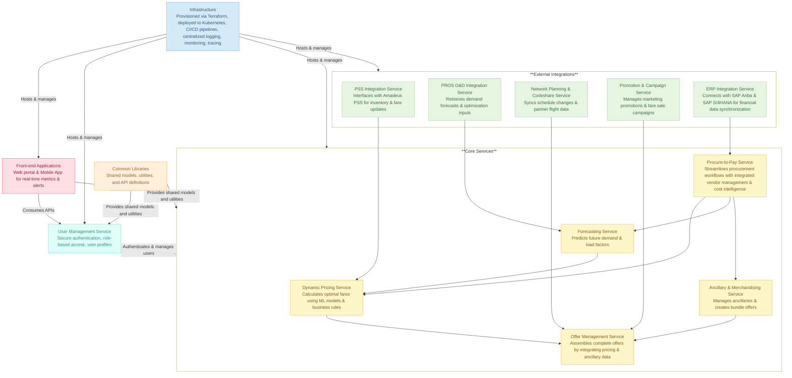

## IAROS: Integrated Airline Revenue Optimization System

**IAROS** is a modular, enterprise-grade product portfolio that helps airlines optimize their full revenue lifecycle—dynamically, scalably, and cost-efficiently.  
This isn't just a project. It's a **platform of platforms**—each module is a standalone product, working together as part of a composite system for airline profitability.

---

### 1. Executive Snapshot

- **IAROS = Revenue Generation + Cost Efficiency + Real-time Optimization + OOD capabilities**
- Designed for **dynamic pricing, forecasting, network planning, ancillary bundling, offer management**, and **procure-to-pay operations**
- Built as **independent modules** with plug-and-play interoperability
- Engineered to scale across **global airline operations**, NDC channels, and legacy systems

> **Built for CXOs, optimized by engineers, ready for the real world.**

---

### 2. What IAROS Solves

| Challenge                              | IAROS Response                                         |
|---------------------------------------|--------------------------------------------------------|
| Static pricing and poor elasticity    | 142 real-time dynamic pricing strategies               |
| Disconnected ancillary revenue        | RL-based dynamic bundling of 110+ ancillary services   |
| Manual, opaque forecasting            | 83 retrainable models (ARIMA, LSTM, hybrid)            |
| Inefficient network planning          | Monte Carlo–based simulations for schedule optimization|
| Offer fragmentation across channels   | Unified Offer Engine with composite personalization    |
| High procurement cost and leakage     | Procure-to-Pay module with ERP/analytics integration   |

---

### 3. The Product Portfolio

#### 3.1 Dynamic Pricing Engine
- Real-time price optimization across 142 scenarios  
- Incorporates geo-fencing, corporate pricing, events, elasticity modeling

#### 3.2 Ancillary Services
- 110+ offerings grouped by flight stage and user profile  
- RL-powered bundling engine + manual override support

#### 3.3 Forecasting Models
- 83 models with retraining, drift detection, and fallback  
- Demand + yield + load + promotional impact forecasting

#### 3.4 Network Optimization
- Schedule + capacity optimization through simulation  
- Codeshare sync + real-time reallocation fallback

#### 3.5 Offer Management Engine
- Aggregates pricing, ancillaries, and loyalty  
- Personalized offers + GraphQL APIs + fallback interfaces

#### 3.6 Procure-to-Pay
- Procurement automation for airline ops  
- Feeds cost signals to pricing/forecasting modules  
- Integrated with vendor KPIs and invoice reconciliation


---

### 4. Architecture at a Glance

- **Microservices**: Each module is fully containerized with its own CI/CD pipeline
- **Orchestration**: Kubernetes-managed deployments across environments
- **Observability**: Prometheus, Grafana, Jaeger for full-stack monitoring
- **Compliance**: GDPR, IATA NDC, internal audit pipelines
- **Interoperability**: REST + GraphQL APIs, OpenAPI specs, modular schemas

---

### 5. Cross-Cutting Capabilities

- **Security & Auth**: OAuth2, JWT, role-based access across services
- **Resilience**: Circuit breakers, caching, graceful degradation paths
- **Fallback Logic**: Across pricing, offers, forecasting, P2P
- **Governance**: Config versioning, audit logs, standardized model validation
- **Cost-to-Revenue Loop**: P2P data → Forecasting → Pricing → Offers

---

### 6. Repository Structure & Stakeholder Guide

| Role             | Recommended Starting Points                          |
|------------------|-------------------------------------------------------|
| Product Manager  | `business_strategy/`, `roadmap.md`, `personas.md`    |
| Tech Lead        | `technical_blueprint/`, `architecture_overview.md`   |
| Backend Dev      | `services/pricing_service/`, `offer_service/`        |
| Data Scientist   | `data_analytics/forecast_models.md`, `forecasting_service/` |
| QA/DevOps        | `QA/`, `infrastructure/`, `scripts/`, `ci-cd/`       |
| Designer         | `brand_design_marketing/UI_UX_Flows.md`, `design_tokens.json` |
| Contributor      | `CONTRIBUTING.md`, `common/`, `README.md`            |

### Directory Snapshot
```bash
├── business_strategy/       # Strategic docs (OKRs, Competitive Benchmarking, Roadmaps)
├── technical_blueprint/     # Architecture, data flow diagrams, and service design
├── services/                # Core products (pricing, forecasting, ancillaries, P2P, etc.)
├── frontend/                # Web portal & mobile app (React, React Native)
├── QA/                      # Test strategy, regression, compliance & incident response
├── data_analytics/          # Forecast models, KPI dashboards, AB tests
├── brand_design_marketing/  # Personas, UI/UX flows, rollout strategies
├── infrastructure/          # Terraform, Kubernetes, Monitoring, CI/CD pipelines
├── config/                  # Environment variables, audit policies, logging
├── common/                  # Shared models, utils, auth, metrics, openAPI spec
├── scripts/                 # Local setup, DB backups, testing, linting
```
---

### 7. Getting Started (Local Dev)

```bash
# Step 1: Clone the repo
git clone https://github.com/suprachakra/Airline-Revenue-Optimization-System.git
cd Airline-Revenue-Optimization-System

# Step 2: Set up local environment
bash scripts/init_local_env.sh

# Step 3: Start everything
bash scripts/start_all.sh

# Optional: Run tests
bash scripts/run_tests.sh
```
Each service also includes its own README.md, config files, and test suite.

*IAROS is a living, composite product portfolio—where each module not only drives revenue but also intelligently manages costs. It is built for modern airlines seeking to excel in a competitive, data-driven market.*
