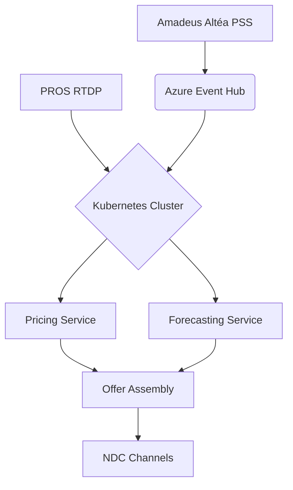

## Architecture Overview
**Core Tenets**: Cloud‑Native Microservices | 99.99% SLA | Multi‑Region Resilience
<br>
IAROS (Integrated Airline Revenue Optimization System) is architected as a modular, microservices‑based, cloud‑native platform. Its design enables independent development, deployment, and scaling of each core module while ensuring they work seamlessly as an integrated portfolio. This document details the technical architecture, including how we handle failures and ensure high availability.


## Key Architectural Components

### 1. API Gateway
- **Purpose:**  
  Acts as the single entry point for all client requests (internal dashboards, external partners) and routes these to the appropriate backend microservices.
- **Key Features:**
  - **Security:**  
    Implements OAuth2 and JWT-based authentication.
  - **Rate Limiting:**  
    Protects downstream services with request throttling.
  - **Caching & Circuit Breakers:**  
    Caches responses and employs circuit breaker patterns to prevent cascading failures.
- **Fallback Strategy:**  
  If a downstream service times out, the API Gateway will return a cached response or a default error message, while logging the incident for further analysis.

### 2. Microservices
Each module (Dynamic Pricing, Ancillary Services, AI Forecasting, Network Planning, and Offer Management) is developed as a containerized microservice in Go. They are independently deployable and communicate via REST and GraphQL APIs.
- **Dynamic Pricing Service:**  
  Implements 142 scenarios using a combination of machine learning and rule‑based systems.  
  - *Fallbacks:* Uses cached prices and manual override dashboards.
- **Ancillary Services Module:**  
  Manages 110+ service bundles with personalized offers.  
  - *Fallbacks:* Defaults to pre‑configured bundles if real‑time data is delayed.
- **Forecasting Service:**  
  Provides real‑time demand forecasts using ARIMA and LSTM models.  
  - *Fallbacks:* Reverts to historical forecast data if retraining fails.
- **Network Planning Module:**  
  Optimizes flight schedules and inventory allocation using simulation models.  
  - *Fallbacks:* Suggests manual intervention with simulation tools if live data is inconsistent.
- **Offer Management:**  
  Composes final offers by integrating outputs from pricing, ancillary, and loyalty services.  
  - *Fallbacks:* Uses previous offers cached in a database and triggers manual review if inconsistencies arise.

### 3. Infrastructure & Cloud-Native Patterns
- **Containerization & Orchestration:**  
  All services are packaged in Docker containers and managed on Kubernetes (using AKS or OpenShift), ensuring auto‑scaling, load balancing, and zero‑downtime deployments.
- **Multi‑Region Deployment:**  
  Critical services are deployed across multiple regions to ensure high availability and disaster recovery.
- **CI/CD Automation:**
Fully automated pipelines (using GitHub Actions, Jenkins, or Azure Pipelines) enforce rigorous testing, blue-green or canary deployments, and automated rollbacks.
- **Observability:**  
  The architecture integrates Prometheus, Grafana, and Jaeger for monitoring, logging, and distributed tracing to quickly identify and remediate issues.
- **Infrastructure as Code:**
  Managed via Terraform to ensure consistency, repeatability, and automated deployments across environments.

### 4. Error Handling and Fallback Mechanisms
- **Circuit Breakers & Retry Logic:**  
  Each microservice incorporates circuit breakers to isolate faults and retries with exponential backoff for transient failures.
```  
// File: services/pricing_service/src/DynamicPricingEngine.go
hystrix.ConfigureCommand("geo-fencing", hystrix.CommandConfig{
    Timeout:                2000,  // 2s timeout for geo‑fencing calls
    MaxConcurrentRequests:  100,   // Maximum 100 concurrent requests
    ErrorPercentThreshold:  25,    // If error rate >25% in a 10s window, fallback activated
})
```
- **Fallback Paths:**  
  Detailed fallback strategies are built into each module. For example, if a pricing API call fails, the system automatically uses cached data and triggers an alert for manual intervention.
- **Automated Health Checks:**  
  Readiness and liveness probes are configured in Kubernetes to detect and recover from failures immediately.
- **Enhanced Security:**
  Data encryption (in transit and at rest), secret management (using Kubernetes Secrets or Vault), and automated vulnerability scanning ensure compliance with GDPR, IATA, and industry best practices.


## Summary
This architecture is designed to be resilient, scalable, and fault‑tolerant. It provides continuous operation even in the event of partial failures by leveraging robust fallback mechanisms, automated monitoring, and multi‑region deployment strategies.

*This document serves as the blueprint for our technical implementation, ensuring every service meets our high standards for performance and reliability.*
