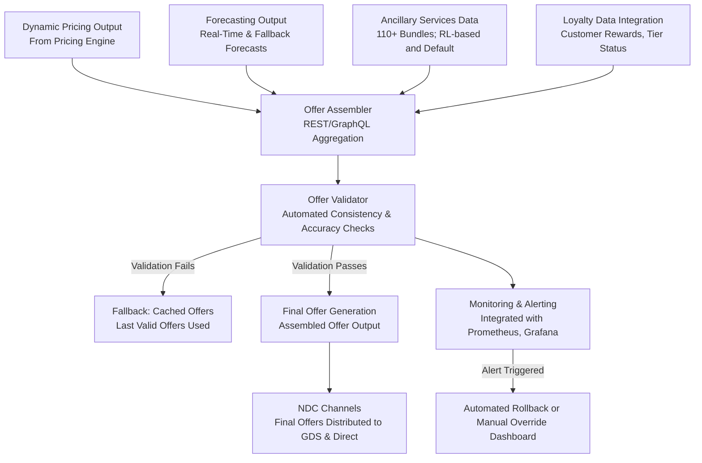

```mermaid
%% Detailed Offer_Integration_Flow.mmd
%% This diagram illustrates the complete integration of outputs from dynamic pricing, forecasting,
%% ancillary services, and loyalty data into the final offer generation process,
%% with detailed error-handling and fallback strategies.

graph TD
    %% Data Sources for Offer Assembly
    A[Dynamic Pricing Output<br/>From Pricing Engine]
    B[Forecasting Output<br/>Real-Time & Fallback Forecasts]
    C[Ancillary Services Data<br/>110+ Bundles; RL-based and Default]
    D[Loyalty Data Integration<br/>Customer Rewards, Tier Status]

    %% Aggregation Process
    A --> E[Offer Assembler<br/>REST/GraphQL Aggregation]
    B --> E
    C --> E
    D --> E

    %% Validation & Fallbacks
    E --> F[Offer Validator<br/>Automated Consistency & Accuracy Checks]
    F -- "Validation Fails" --> G[Fallback: Cached Offers<br/>Last Valid Offers Used]
    F -- "Validation Passes" --> H[Final Offer Generation<br/>Assembled Offer Output]

    %% Error Handling & Monitoring
    F --> I[Monitoring & Alerting<br/>Integrated with Prometheus, Grafana]
    I -- "Alert Triggered" --> J[Automated Rollback or Manual Override Dashboard]

    %% Integration with Distribution Channels
    H --> K[NDC Channels<br/>Final Offers Distributed to GDS & Direct]
    
    %% Inline Annotations
    click F "https://example.com/offer-validation" "Offer Validator: Ensures all integrated data is accurate and complete."
    click G "https://example.com/cached-offers" "Fallback mechanism: Uses previously validated offers if real-time generation fails."
    click I "https://example.com/monitoring-alerts" "Real-time monitoring and automated rollback processes."

```
