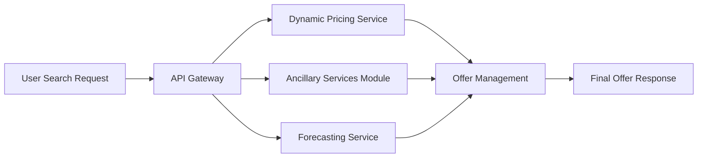

```mermaid
flowchart LR
    A[User Search Request] --> B[API Gateway]
    B --> C[Dynamic Pricing Service]
    B --> D[Ancillary Services Module]
    B --> E[Forecasting Service]
    C --> F[Offer Management]
    D --> F
    E --> F
    F --> G[Final Offer Response]

    %% Detailed Annotations:
    %% A: User initiates a search request from a web or mobile interface.
    %% B: The API Gateway routes the request concurrently to the Pricing, Ancillary, and Forecasting services.
    %% C, D, E: Each service processes its respective domain; inline fallback mechanisms ensure each call returns within 200ms.
    %% F: The Offer Management service aggregates data, applies personalization, and ensures compliance with fallback protocols if one module fails.
    %% G: Final offer is returned to the user with error messages or alternate offers if data integrity issues are detected.
```
