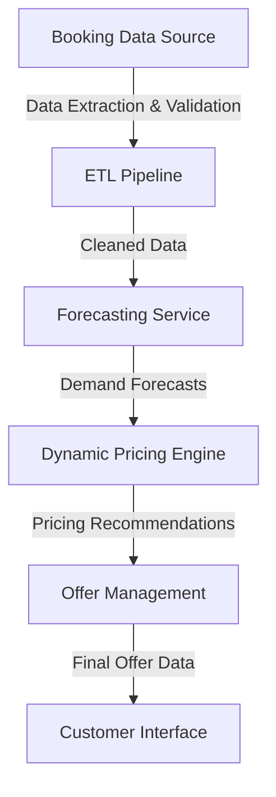

```mermaid
flowchart TD
    A[Booking Data Source] -->|Data Extraction & Validation| B[ETL Pipeline]
    B -->|Cleaned Data| C[Forecasting Service]
    C -->|Demand Forecasts| D[Dynamic Pricing Engine]
    D -->|Pricing Recommendations| E[Offer Management]
    E -->|Final Offer Data| F[Customer Interface]

    %% Detailed Annotations:
    %% A: Aggregates raw booking data from legacy systems (PSS) and new digital channels.
    %% B: The ETL pipeline performs rigorous data validation and transformation; any data anomalies trigger alerts.
    %% C: The forecasting service uses ARIMA and LSTM models to predict demand; if model accuracy falls, cached historical data is used.
    %% D: The dynamic pricing engine adjusts fares in real time; circuit breakers and fallback pricing ensure continuity.
    %% E: Offer management integrates pricing, ancillary, and loyalty data into cohesive offers; fallback to last known good offers if real-time aggregation fails.
```
