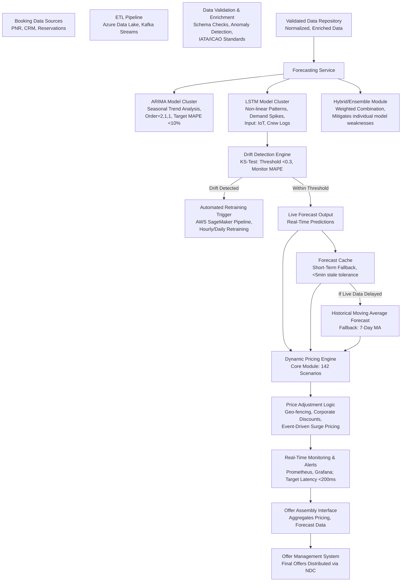

```mermaid
%% Detailed Pricing_Forecasting_DataFlow.mmd
%% This diagram details the complete flow from raw booking data ingestion to the output of dynamic pricing,
%% including forecasting, data validation, retraining triggers, and multiple fallback mechanisms.

graph TD
    %% Data Ingestion & Validation
    A[Booking Data Sources<br/>PNR, CRM, Reservations]
    B[ETL Pipeline<br/>Azure Data Lake, Kafka Streams]
    C[Data Validation & Enrichment<br/>Schema Checks, Anomaly Detection,<br/>IATA/ICAO Standards]
    D[Validated Data Repository<br/>Normalized, Enriched Data]

    %% Forecasting Module
    D --> E[Forecasting Service]
    E --> E1[ARIMA Model Cluster<br/>Seasonal Trend Analysis,<br/>Order=2,1,1, Target MAPE <10%]
    E --> E2[LSTM Model Cluster<br/>Non‑linear Patterns, Demand Spikes,<br/>Input: IoT, Crew Logs]
    E --> E3[Hybrid/Ensemble Module<br/>Weighted Combination,<br/>Mitigates individual model weaknesses]
    
    %% Drift Detection & Retraining
    E2 --> F[Drift Detection Engine<br/>KS-Test: Threshold <0.3, Monitor MAPE]
    F -- "Drift Detected" --> G[Automated Retraining Trigger<br/>AWS SageMaker Pipeline,<br/>Hourly/Daily Retraining]
    F -- "Within Threshold" --> H[Live Forecast Output<br/>Real-Time Predictions]
    
    %% Forecast Fallback Mechanisms
    H --> I[Forecast Cache<br/>Short-Term Fallback, <5min stale tolerance]
    I -- "If Live Data Delayed" --> J[Historical Moving Average Forecast<br/>Fallback: 7-Day MA]
    
    %% Integration into Pricing Engine
    H --> K[Dynamic Pricing Engine<br/>Core Module: 142 Scenarios]
    I --> K
    J --> K
    K --> L[Price Adjustment Logic<br/>Geo‑fencing, Corporate Discounts,<br/>Event‑Driven Surge Pricing]
    L --> M[Real-Time Monitoring & Alerts<br/>Prometheus, Grafana; Target Latency <200ms]
    
    %% Final Output Flow
    M --> N[Offer Assembly Interface<br/>Aggregates Pricing, Forecast Data]
    N --> O[Offer Management System<br/>Final Offers Distributed via NDC]
    
    %% Inline Annotations (Clickable links for details)
    click C "https://example.com/data-validation" "Data validation: Schema and anomaly detection processes."
    click G "https://example.com/retraining-trigger" "Automated retraining triggers based on drift detection."
    click I "https://example.com/forecast-cache" "Short-term cache used if live forecasts are delayed."
    click J "https://example.com/historical-forecast" "Fallback to 7-day moving average when necessary."

```
