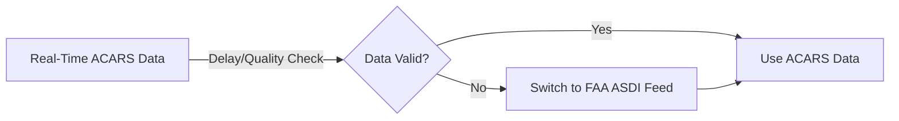

## Network Optimization Module

The Network Optimization Module is designed to:
- **Optimize Flight Scheduling:** Adjust aircraft rotations (e.g., for A380) to maximize revenue and minimize fuel consumption.
- **Dynamic Inventory Allocation:** Reallocate seat inventory in real time based on demand forecasts.
- **Codeshare Synchronization:** Ensure accurate and consistent flight data with partner airlines.

The Network Optimization Module enhances flight scheduling, inventory allocation, and codeshare synchronization by integrating real-time revenue and operational data. Advanced simulation models—including Monte Carlo simulations—are employed to generate optimal schedules and inventory adjustments. Robust fallback paths are in place to handle delays or inaccuracies in real-time data (e.g., from ACARS), ensuring continuous operation and significant cost savings (targeting up to 12% fuel savings on transatlantic routes).

---

### 1. Key Components
#### 1.1 Flight Scheduling Optimization: Monte Carlo Simulation Engine

| **Aspect**         | **Details**                                                                                                                                                         |
|--------------------|---------------------------------------------------------------------------------------------------------------------------------------------------------------------|
| **Purpose**        | Optimize aircraft utilization (e.g., A380 rotations) by simulating various schedule scenarios and selecting the one with the lowest delay/fuel cost.              |
| **Method**         | Utilize Monte Carlo simulations to explore 1,000+ random rotation scenarios using real-time and historical operational data.                                           |
| **Fallback Strategy** | If live data (e.g., from ACARS) is stale (older than 15 minutes), automatically switch to an alternative data source such as the FAA ASDI feed.                    |

**Implementation Example (Python):**
```python
# File: services/network_service/src/Scheduler.py
import numpy as np

def optimize_a380():
    current_schedule = get_current_schedule()
    best_score = evaluate_schedule(current_schedule)
    # Run Monte Carlo simulation for 1000 iterations
    for i in range(1000):
        candidate_schedule = monte_carlo_search(current_schedule)
        candidate_score = evaluate_schedule(candidate_schedule)
        if candidate_score < best_score:
            best_score = candidate_score
            current_schedule = candidate_schedule
    return current_schedule
```
#### Fallback: 
- Threshold: If real‑time ACARS data is delayed for more than 15 minutes.
- Action: Automatically switch to an alternate data source (e.g., FAA ASDI feed) or revert to historical average schedules.
---

#### 1.2 Real-Time Inventory Reallocation

| **Aspect**             | **Implementation Details**                                                                                                                                                      | **Fallback Strategy**                                                                                                  |
|------------------------|---------------------------------------------------------------------------------------------------------------------------------------------------------------------------------|------------------------------------------------------------------------------------------------------------------------|
| **Purpose**            | Dynamically adjust seat inventory based on demand forecasts from dynamic pricing and forecasting modules.                                                                    | If real-time demand signals are unavailable, default to historical allocation patterns.                              |
| **Method**             | Integrate signals from pricing and forecasting modules to reassign seat inventory across flights in real time.                                                                | Use cached inventory data from the previous day if live data fails to update.                                          |
| **Monitoring**         | Continuous monitoring via Prometheus ensures that inventory adjustments are applied within defined SLA thresholds.                                                             | Trigger alerts for manual review if discrepancies exceed 5%.                                                          |

---

#### 1.3 Codeshare Synchronization

| **Aspect**             | **Implementation Details**                                                                                                                                                      | **Fallback Strategy**                                                                                                  |
|------------------------|---------------------------------------------------------------------------------------------------------------------------------------------------------------------------------|------------------------------------------------------------------------------------------------------------------------|
| **Purpose**            | Synchronize flight data with partner airlines to ensure consistency in schedules and inventory.                                                                               | If API synchronization fails or data discrepancies exceed 5%, maintain the last known good configuration.               |
| **Method**             | Utilize secure APIs with robust retry logic and data validation to fetch and update codeshare information. (e.g., leveraging SHAP analysis to verify consistency).                                                                   | In the event of persistent errors, alert the operations team and default to the last synchronized data snapshot.         |
| **Example Code**       | See pseudocode below.                                                                                                                                                           | Log errors for postmortem analysis.                                                                                    |

**Pseudocode (Go):**
```go
// File: services/network_service/src/PartnerSync.go
func SyncCodeshareData() error {
    data, err := partnerAPI.FetchFlightData()
    if err != nil {
        log.Error("Codeshare synchronization failed:", err)
        return err  // Trigger fallback: use last known configuration
    }
    // Validate data and update system state
    updateFlightSchedule(data)
    return nil
}
```

---

### 2. Handling External Data Delays

| **Data Type**         | **Threshold**                | **Action**                                       |
|-----------------------|------------------------------|--------------------------------------------------|
| **Flight Status**     | >15 minutes stale            | Switch to FAA ASDI feed                          |
| **Demand Forecast**   | MAE >20%                     | Use 14-day rolling average                       |
| **Partner Schedules** | >5% discrepancy              | Revert to last valid cached configuration        |  

**Mermaid Diagram:**

---

### 3. Testing and Validation

| **Testing Type**        | **Description**                                                                                                              | **Tools/Methods**                                        |
|-------------------------|------------------------------------------------------------------------------------------------------------------------------|----------------------------------------------------------|
| **Unit Tests**          | Validate individual functions (e.g., simulation, inventory adjustment) with various data scenarios.                           | Python unittest, Go testing framework                    |
| **Integration Tests**   | End-to-end tests simulate the complete data flow from real-time inputs to schedule optimization and codeshare synchronization. | CI/CD pipelines (GitHub Actions, Jenkins)                |
| **Monitoring & Alerts** | Continuous monitoring via Prometheus, Grafana, and Jaeger; alert thresholds set for data delays and integration errors.         | Prometheus, Grafana, Jaeger                              |

---

### 4. Summary & Final Validation

| **Aspect**                | **Description**                                                                                                                       |
|---------------------------|---------------------------------------------------------------------------------------------------------------------------------------|
| **Operational Robustness**| Every component includes detailed fallback strategies, ensuring continuous operation even when real-time data is delayed or unavailable. |
| **Integration Efficiency**| The module seamlessly integrates dynamic pricing, forecasting, and codeshare data to optimize flight schedules and inventory.         |
| **Regulatory Compliance** | Designed to meet industry standards and regulatory requirements (e.g., IATA guidelines) with robust monitoring and audit trails.         |
| **Comprehensive Testing** | Extensive unit and integration tests, combined with real-time monitoring, ensure that any failure triggers automatic fallback mechanisms. |

---
