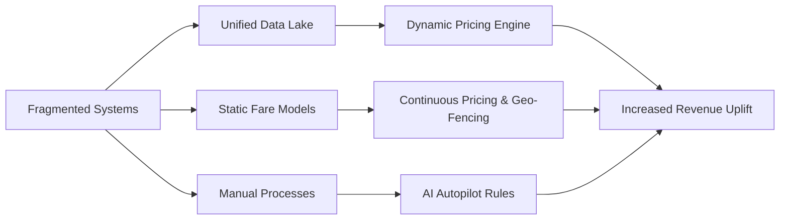

## Gap Analysis

### Critical Industry Challenges
| **Challenge**                            | **Problem**                                                                                         | **Solution**                                                                                                  |
|------------------------------------------|-----------------------------------------------------------------------------------------------------|---------------------------------------------------------------------------------------------------------------|
| **Fragmented Systems**                   | Up to 38% of airline data remains unused due to siloed PSS, CRM, and NDC systems                     | Unified Azure data lake with a PROS-Amadeus API bridge to centralize and process data in real time              |
| **Static Fare Models**                   | Traditional models use only 26 ATPCO fare buckets, limiting flexibility                               | Implement continuous pricing with 53 interim price points and dynamic geo‑fencing to capture market fluctuations  |
| **Manual Processes**                     | Analysts spend up to 34% of their time manually overriding fare decisions                           | Reinforcement learning-based autopilot rules that significantly reduce manual interventions                   |
| **Limited Personalization in Ancillary Services** | 68% of ancillary offers lack personalization, resulting in lost revenue                               | A bundling engine that leverages 112 attributes to create personalized service bundles                          |
| **Ineffective Forecasting Models**       | Current forecasting models average only 72% accuracy due to model drift and inconsistent data sources | Continuous retraining of 83 forecasting models using LSTM and ARIMA to achieve 90%+ accuracy                    |

### Quantified Impact
| **Metric**                     | **Current**             | **Target**                     |
|--------------------------------|-------------------------|--------------------------------|
| Revenue Leakage                | $4.6B industry-wide     | Significant reduction via optimization |
| Ancillary Personalization Rate | 32%                     | Increase to 68%+ with dynamic bundling  |
| Forecast Accuracy              | 72%                     | 90%+ via continuous retraining           |
| Fuel Savings (Network Planning)| N/A                     | 12% savings on transatlantic routes       |

### Market Gap Diagram

### Emerging Market Needs
| **Gap**                | **Our Tech Response**                  | **Validation Source**         |
|------------------------|----------------------------------------|-------------------------------|
| Hyper-personalization  | 112-attribute bundling engine          | Etihad PROS integration       |
| Disruption Recovery    | Monte Carlo voucher engine             | Qatar IOC case studies        |
| Sustainability         | AI fuel optimizer (ARIMA-based)        | Emirates Climavision reports  |

Our analysis reveals that by addressing these gaps, IAROS can unlock billions in potential revenue and significantly enhance operational efficiency.
