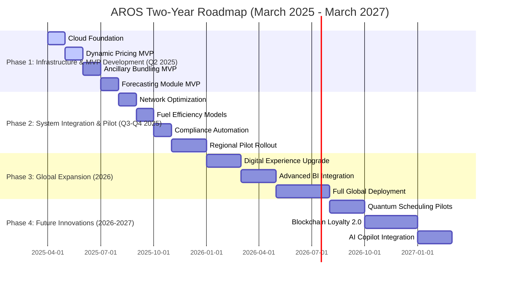

## Roadmap and Milestones

2 year roadmap for the Airline Revenue Optimization System (AROS). Each row in the table represents 2 sprints (4 weeks), detailing phase objectives, key activities, integrated epics, teams involved, dependencies, sprint goals & success metrics, deliverables, SAFe milestones, risks & mitigations, expected outcomes, and the achievement of all strategic objectives—delivering transformative improvements in airline revenie optimization.
[Detailed view](#roadmap)

| **Phase**                                         | **Timeframe (Months)** | **Milestones & Key Activities**                                                                                                                                                                                                                                                                                                           | **Dependencies & Risks**                                                                               | **Outcome (with Metrics)**                                                                                          |
|---------------------------------------------------|------------------------|--------------------------------------------------------------------------------------------------------------------------------------------------------------------------------------------------------------------------------------------------------------------------------------------------------------------------------------------|--------------------------------------------------------------------------------------------------------|---------------------------------------------------------------------------------------------------------------------|
| **Phase 1: Infrastructure & MVP Development**   | 1–3                    | - **Infrastructure Setup:** Establish Kubernetes clusters, CI/CD pipelines, API Gateway, and service mesh. - **Pricing Engine MVP:** Develop and validate 142 pricing scenarios. - **Ancillary Module MVP:** Implement AI‑driven ancillary bundling for 110+ services. - **Forecasting & Network MVP:** Deploy demand forecasting models and simulation‑based network planning. - **Offer Management MVP:** Aggregate module outputs to generate final offers.  | Dependent on cloud provider readiness and reliable data feeds; risks include integration delays mitigated by automated fallback and circuit breakers. | Fully operational MVP in staging; KPIs: <200ms API latency, 95% test pass rate, validated functionality across modules.  |
| **Phase 2: Integration & Pilot Rollout**          | 3–6                    | - **Fuel Optimization Module:** Deploy predictive models to reduce fuel burn. - **Compliance & Security Automation:** Implement automated controls and enhanced security measures. - **CI/CD & Ops Enhancements:** Refine deployment pipelines, auto‑scaling, and observability. - **Global Rollout Pilot Phase 1:** Pilot MVP in select regions with full monitoring and feedback collection. | Depends on stable partner API integrations and updated regulatory guidelines; risks mitigated by multi-region failover and continuous monitoring.           | Integrated system with fallback mechanisms validated; KPIs: ≥99% uptime, positive pilot feedback, and measurable revenue uplift. |
| **Phase 3: Expansion, Optimization & Digital Transformation** | 6–10                   | - **Digital Experience Enhancements:** Refine UI/UX for ancillary offers across mobile/web platforms. - **Advanced BI Integration:** Deploy unified dashboards and real‑time analytics. - **Global Rollout Phase 2:** Scale deployment to additional regions and partners with localization efforts.                             | Dependent on customer feedback, advanced BI tool readiness, and regional regulatory compliance; risks mitigated by iterative design and A/B testing.        | Improved customer engagement, higher conversion rates; KPIs: NPS >90%, UI latency <100ms, high partner integration success.         |
| **Phase 4: Future Innovations & Strategic Roadmap** | 10–24                  | - **Next‑Generation Innovation Kickoff:** Initiate R&D for quantum annealing, advanced blockchain loyalty, and enhanced predictive analytics. - **Advanced Analytics Expansion:** Scale up new AI models and further integrate BI tools. - **Continuous Improvement:** Establish regular review cycles to iterate on performance and cost optimization. - **Global Expansion:** Complete full‑scale rollout with localized configurations and partner integrations. - **Final Roadmap Revision:** Finalize a long‑term strategic roadmap for next‑gen enhancements. | Depends on successful R&D outcomes, continued funding, and cross-departmental collaboration; risks mitigated by phased rollouts and controlled pilot testing.  | A future‑proof, continuously improving system with sustained high performance and revenue growth; KPIs include sustained 99.99% uptime and ongoing revenue uplift.       |

### Roadmap

| **Timeframe (Sprints/Month)** | **Phase & Objectives**                                                                                                                                         | **Key Activities / Tasks**                                                                                                                                                                                                                                                                                         | **Integrated Epics**                                          | **Teams Involved**                        | **Dependencies**                                           | **Sprint Goals & Success Metrics**                                                                                             | **Deliverables**                                         | **SAFe Milestones & ART Events**                                             | **Risks & Mitigations**                                                                                                          | **Outcomes**                                                                                          |
|-------------------------------|----------------------------------------------------------------------------------------------------------------------------------------------------------------|--------------------------------------------------------------------------------------------------------------------------------------------------------------------------------------------------------------------------------------------------------------------------------------------------------------------|--------------------------------------------------------------|-------------------------------------------|-----------------------------------------------------------|----------------------------------------------------------------------------------------------------------------------------------|----------------------------------------------------------|----------------------------------------------------------------------------|---------------------------------------------------------------------------------------------------------------------------------|-------------------------------------------------------------------------------------------------------|
| Sprints 1-2 (Month 1)         | **Phase 1: Infrastructure & MVP Development** Establish the cloud foundation, basic CI/CD pipelines, and API Gateway as part of the Agile Release Train (ART) kick-off.  | - Provision Kubernetes clusters using Terraform. - Set up API Gateway with OAuth2/JWT, and configure service mesh (Istio). - Initiate CI/CD pipelines. - Conduct initial PI Planning for MVP.                                                                                                   | EPIC-6: Operational & Security Excellence                     | Engineering, DevOps, IT, Product            | Cloud provider readiness, network connectivity            | 100% infrastructure health; API response <200ms; automated health checks; ART PI Planning completed.                          | Staging environment, API Gateway, CI/CD pipelines deployed  | PI Planning, ART Kickoff, Iteration Planning                                  | Misconfigurations mitigated via automated health checks and peer reviews.                                                   | Strong cloud foundation established for subsequent module integration.                               |
| Sprints 3-4 (Month 1)         | **Dynamic Pricing Engine MVP** Develop and test the dynamic pricing engine for 142 scenarios.                                                                  | - Develop pricing logic (geo‑fencing, corporate discounts). - Integrate circuit breakers and caching. - Execute unit/integration tests and perform WSJF prioritization.                                                                                                                               | EPIC-1: Dynamic Pricing Engine                                  | Engineering, Data, QA                      | Access to historical pricing data                          | API response <200ms; all scenarios validated; WSJF scores meet targets; PI objectives met.                                      | MVP pricing engine module                                | PI Planning, ART Iteration Reviews                                             | Data latency risk mitigated with circuit breakers and caching; fallback dashboard in place.                                  | Dynamic pricing engine validated and ready for integration.                                          |
| Sprints 5-6 (Month 2)         | **Ancillary Services Module MVP** Implement AI‑driven ancillary bundling (110+ bundles) with integrated lean portfolio management.                             | - Build AI recommendation engine for bundling. - Integrate CRM data for segmentation. - Develop fallback logic (default bundles) and conduct automated tests.                                                                                                                                | EPIC-2: Ancillary Services Module                               | Engineering, Marketing, QA, Product         | CRM data integration, partner API readiness                | Bundle accuracy >95%; fallback activated if data is stale; customer-centric KPIs meet PI targets.                              | MVP ancillary bundling module with test reports          | PI Planning, ART Demo, Inspect & Adapt Workshop                                | Inconsistent data mitigated with Redis caching and default bundles; continuous automated monitoring.                      | Ancillary module operational with personalized bundles and high customer satisfaction.               |
| Sprints 7-8 (Month 2)         | **Forecasting & Network Optimization MVP** Deploy 83 forecasting models and integrate Monte Carlo simulations for flight scheduling and inventory reallocation. | - Deploy ARIMA/LSTM forecasting models. - Implement drift detection (KS-test) and automated retraining via AWS SageMaker. - Integrate with network optimization simulation (Monte Carlo).                                                                                                     | EPIC-3: Forecasting Module EPIC-4: Network Optimization Module  | Data, Engineering, Ops, QA                  | Historical and real-time data feeds                        | Forecast accuracy ≥90%; simulation outputs show ≥10% cost reduction; automated retraining triggers on drift.                   | Deployed forecasting models and network simulation module | PI Planning, ART Iteration Review, Inspect & Adapt                              | Data drift mitigated by automated retraining and fallback to historical models; simulation fallback to alternate feeds if data stale. | Reliable demand forecasts and optimized scheduling capabilities validated.                          |
| Sprints 9-10 (Month 3)        | **Offer Management System MVP** Aggregate outputs from pricing, ancillary, and forecasting modules to generate final offers using SAFe principles.           | - Develop data merging algorithms using REST/GraphQL. - Validate final offers with automated tests; implement caching for fallback. - Coordinate with ART for end-to-end integration.                                                                                                        | EPIC-5: Offer Management System                                  | Engineering, Product, QA, Marketing          | Completion of pricing, ancillary, and forecasting integrations | Final offers generated with ≥99% success rate; integration tests pass; WSJF prioritization ensures best value delivery.          | Fully functional offer management system with integration reports | PI Planning, ART Demo, Inspect & Adapt                                        | Integration risks mitigated with automated validations and fallback to cached offers; continuous monitoring via ART events.      | Unified offer management system fully integrated, ready for global rollout.                        |
| Sprints 11-12 (Month 3)       | **Fuel Optimization Module MVP** Deploy predictive models for fuel optimization, contributing to sustainability KPIs.                                             | - Implement ARIMA/LSTM models for fuel consumption forecasting. - Integrate contrail avoidance and wind shear response models. - Validate models against historical data.                                                                                                                | EPIC-7: Fuel Optimization Module                                 | Engineering, Sustainability, Data           | Sensor data, satellite feeds, historical fuel data         | Achieve 12% fuel savings in simulations; fallback to static burn rates if sensor data unavailable; meets PI sustainability targets. | Fuel optimization module and simulation reports          | PI Planning, ART Iteration Review                                            | Risk of sensor data delay mitigated by backup feeds (e.g., ECMWF) and fallback to historical rates.                           | Demonstrated fuel savings and operational cost improvements validated.                            |
| Sprints 13-14 (Month 4)       | **Compliance & Security Automation** Implement and validate automated policy-as-code for compliance and enhanced security across the system.                   | - Develop policy-as-code templates; integrate with CI/CD pipelines; conduct automated security scans and compliance audits; update vulnerability management processes.                                                             | EPIC-8: Compliance Automation                                   | Engineering, Legal, Compliance, Security      | Regulatory framework updates, vulnerability scanning tools  | 100% compliance achieved; no critical vulnerabilities; security audit passes; PI objectives for security met.                 | Automated compliance engine, security audit reports, updated policy templates | PI Planning, ART Inspect & Adapt, Security Milestone                           | Mitigate regulatory change risks with continuous policy updates and automated audits; fallback: revert to previously secured baseline configurations. | Fully compliant and secure system with continuous monitoring and automated remediation in place.     |
| Sprints 15-16 (Month 4)       | **CI/CD & Ops Enhancements / Global Rollout Pilot Phase 1** Refine deployment pipelines, auto-scaling, and observability; pilot rollout in select regions.  | - Enhance CI/CD pipelines for zero-downtime deployments; configure multi‑region auto‑scaling and load balancing; integrate full observability (Prometheus, Grafana, Jaeger); pilot rollout in select regions with continuous monitoring. | EPIC-6: Operational & Security Excellence                        | Engineering, Ops, DevOps, Marketing           | Fully functional MVP modules; stable cloud resources       | Achieve system uptime of 99.99%; monitoring dashboards display KPIs within targets; pilot feedback >80% positive; successful global pilot deployment.  | Improved CI/CD pipelines, auto‑scaling configurations, observability dashboards, pilot rollout reports | PI Planning, ART Demo, Global Pilot Milestone                                   | Risk: Cloud outages mitigated via multi‑region failover; security and scaling risks mitigated through continuous monitoring and automated rollbacks.  | Robust, scalable, and secure system ready for full global deployment following pilot success.          |
| Sprints 17-18 (Month 5)       | **Digital Experience Enhancements & Advanced BI Integration** Refine UI/UX for ancillary offers and integrate unified BI dashboards.                          | - Enhance mobile/web UI for personalized offers; implement real-time BI dashboards using Power BI/Looker; conduct A/B tests for personalization features; train teams on analytics tools.                                         | EPIC-2: Ancillary Services EPIC-5: Offer Management               | UX, Marketing, Engineering, Product, Data      | Feedback from pilot rollout; stable integration with BI systems        | Improve customer satisfaction (NPS uplift >10%); UI latency <100ms; BI dashboards adopted by >80% of target users; successful A/B test results. | Updated digital interfaces, BI dashboards, A/B test reports, user training materials | PI Planning, ART Inspect & Adapt, Digital Experience Milestone                  | Risk: UI/UX inconsistencies mitigated by iterative design and A/B testing; fallback: revert to previously stable versions if issues arise.             | Enhanced customer engagement and higher conversion rates with improved digital touchpoints.           |
| Sprints 19-20 (Month 5)       | **Global Rollout Phase 2** Scale the system to additional regions and integrate new partner APIs.                                                           | - Expand deployment to additional regions; onboard new airline partners; integrate new partner APIs; localize configurations; ensure regulatory compliance for each region; conduct end-to-end integration tests.                           | EPIC-5: Offer Management EPIC-2: Ancillary Services               | Engineering, Product, Sales, Legal, Ops          | Successful pilot rollout; stable partner API integrations              | Global expansion to >50% of target regions; ≥95% partner integration success; localized compliance achieved; positive market feedback collected.            | Expanded global deployment, partner integration reports, localized system configurations        | PI Planning, ART Global Rollout Milestone                                       | Risk: Regional regulatory and integration issues mitigated via phased rollout and localized adjustments; fallback: pilot new regions before full expansion.  | Successful expansion with robust partner integrations and full regional compliance.                  |
| Sprints 21-22 (Month 6)       | **Operational Efficiency & Continuous Improvement** Implement continuous improvement cycles and fine-tune operational processes.                             | - Set up quarterly reviews; integrate real-time feedback loops; refine network optimization and inventory reallocation; update cost analytics dashboards; implement iterative improvements.                                            | All Epics                                                    | All Departments                                | Consistent performance data and stakeholder feedback                    | Achieve incremental revenue uplift (1-2% per quarter); OTP improvements; cost reductions; documented improvements in quarterly reports.                    | Quarterly improvement reports, updated system configurations, revised operational procedures        | PI Planning, ART Inspect & Adapt, Continuous Improvement Milestone             | Risk: Insufficient feedback mitigated by automated data collection and independent audits; fallback: use historical trends to guide updates.                | Ongoing performance enhancements, increased efficiency, and sustained revenue growth over time.         |
| Sprints 23-24 (Month 6)       | **Security, Compliance & Disaster Recovery Enhancement** Strengthen security measures, ensure full compliance, and refine disaster recovery strategies.       | - Conduct full security and compliance audits; update policy-as-code templates; enhance disaster recovery plans; integrate additional failover mechanisms; test recovery scenarios.                                                 | EPIC-8: Compliance Automation EPIC-6: Operational & Security Excellence | Security, Engineering, Legal, Compliance         | Updated regulatory guidelines; security tool integrations; final pilot data | Zero critical vulnerabilities; 100% compliance in audits; disaster recovery tests meet RPO ≤15s and RTO ≤60s; documented and verified failover processes.  | Security audit reports, updated DR plans, compliance dashboards, policy-as-code updates               | PI Planning, ART Security & Compliance Milestone                              | Risk: Emerging vulnerabilities mitigated by continuous monitoring and rapid patch deployment; fallback: revert to hardened baseline configurations if necessary.  | Fully secure, compliant, and resilient system across all regions.                                    |
| Sprints 25-26 (Month 7)       | **Next-Generation Innovation Kickoff** Initiate R&D for next-gen technologies (quantum annealing, enhanced blockchain loyalty, advanced analytics).        | - Kick off R&D projects for quantum annealing-based scheduling, enhanced blockchain loyalty, and new AI predictive models; hold cross-functional workshops; gather pilot data and feasibility studies.                        | EPIC-1: Dynamic Pricing EPIC-2: Ancillary Services EPIC-8: Compliance Automation  | R&D, Engineering, Product, Data, Marketing         | Funding approvals; initial R&D findings; tech partner collaboration     | Successful prototype demonstrations; feasibility reports; positive pilot feedback (>80%); strategic roadmap updates; PI objectives met.                  | Next-gen innovation prototypes, updated long-term roadmap, feasibility study reports                   | PI Planning, ART Next-Gen Innovation Kickoff                                  | Risk: High R&D risk mitigated via controlled pilots and incremental innovation; fallback: maintain current systems while iterating on new technologies.  | Foundation for next-gen innovations established, with validated prototypes driving future revenue improvements.    |
| Sprints 27-28 (Month 7)       | **Advanced Analytics & BI Expansion** Scale up advanced predictive models and enhance unified BI dashboards for executive decision-making.                | - Integrate federated learning and counterfactual analysis models; update and expand BI dashboards; train end users on new analytics tools; automate complex reporting processes.                                               | EPIC-3: Forecasting EPIC-6: Operational & Security Excellence      | Data, Engineering, Product, Marketing             | Unified data lake; advanced BI tool integrations; robust ETL pipelines      | Dashboards show real-time KPIs with >80% user adoption; weekly automated reports; additional revenue uplift of 1-2% demonstrated; PI targets achieved.   | Updated predictive models, enhanced BI dashboards, user training materials                           | PI Planning, ART Advanced Analytics Milestone                                  | Risk: Integration challenges mitigated by phased rollouts and fallback to historical data analysis; fallback: revert to previous model versions if issues arise.   | Enhanced analytics leading to deeper insights and improved revenue performance.                         |
| Sprints 29-30 (Month 8)       | **Global Rollout Phase 2 & Market Expansion** Expand global deployment to additional regions and onboard new airline partners.                             | - Scale global deployment; integrate new partner APIs; localize system configurations; ensure regulatory compliance for each region; conduct pilot rollouts in new markets; collect market feedback.                         | EPIC-5: Offer Management EPIC-2: Ancillary Services                   | Engineering, Sales, Product, Legal, Ops            | Successful Phase 1 rollout; stable partner API integrations; local regulatory approvals | Expansion to >50% of target regions; partner integration success ≥95%; positive market feedback; localized compliance confirmed; PI objectives met.       | Expanded deployment, partner integration reports, localized compliance documentation                   | PI Planning, ART Global Rollout Milestone                                      | Risk: Regional differences mitigated via localized compliance strategies and phased rollouts; fallback: pilot new regions before full expansion.              | Successful global expansion with robust partner integrations and full regional compliance.              |
| Sprints 31-32 (Month 8)       | **Post-Rollout Continuous Improvement & System Optimization** Establish continuous improvement cycles and fine-tune system performance.                   | - Schedule quarterly reviews; integrate automated feedback loops; refine operational and network optimization processes; update cost analytics dashboards; document iterative improvements.                                  | All Epics                                                  | All Departments                                   | Ongoing data collection; established feedback mechanisms; stakeholder alignment      | Measurable incremental improvements (e.g., 1-2% revenue uplift per quarter); documented system enhancements; high stakeholder satisfaction; PI targets met.    | Quarterly improvement reports, updated system configurations, and process improvement documentation    | PI Planning, ART Inspect & Adapt, Continuous Improvement Milestone             | Risk: Insufficient feedback mitigated by automated monitoring and independent audits; fallback: use historical trends to guide updates.                         | Continuous performance enhancements, increased operational efficiency, and sustained revenue growth.                      |
| Sprints 33-34 (Month 9)       | **Security & Compliance Reinforcement** Conduct comprehensive security audits and update disaster recovery plans.                                       | - Perform full security and compliance audits; enhance vulnerability scanning; update policy-as-code templates; refine disaster recovery strategies; test failover scenarios.                                             | EPIC-8: Compliance Automation EPIC-6: Operational & Security Excellence  | Security, Legal, Engineering, Compliance            | Updated regulatory frameworks; integration with security tools; pilot feedback data        | Zero critical vulnerabilities; 100% compliance in simulated audits; disaster recovery tests meet RPO ≤15s and RTO ≤60s; documentation complete.            | Security audit reports, updated DR plans, compliance dashboards, policy updates                     | PI Planning, ART Security & Compliance Milestone                              | Risk: New vulnerabilities mitigated by continuous monitoring and rapid patch deployment; fallback: revert to hardened baseline configurations if necessary.     | Fully secure, compliant system with robust disaster recovery and security posture established.                          |
| Sprints 35-36 (Month 9)       | **Performance & Scalability Optimization** Conduct rigorous stress testing and optimize auto‑scaling and load balancing.                                | - Execute performance stress tests simulating 5M concurrent users; optimize HPA settings; refine caching and rate limiting; update auto-scaling configurations; conduct performance regression tests.                      | EPIC-6: Operational & Security Excellence, EPIC-1: Dynamic Pricing          | Engineering, DevOps, QA, IT                         | Baseline performance benchmarks; cloud resource availability; historical load data        | System supports 5M users with API latency <200ms under peak load; auto-scaling triggers effectively; performance metrics meet targets; all tests pass.        | Stress test reports, updated auto-scaling policies, load balancing configurations                      | PI Planning, ART Scalability Milestone                                        | Risk: Performance bottlenecks mitigated by real-time monitoring and dynamic scaling adjustments; fallback: revert to baseline configurations if necessary.      | Optimized, scalable system with robust performance under peak loads.                                |
| Sprints 37-38 (Month 10)      | **Digital Experience & BI Transformation** Refine UI/UX for ancillary offers and integrate unified BI dashboards for executive analytics.              | - Enhance web/mobile UI based on pilot feedback; implement additional personalization features; deploy unified BI dashboards; conduct A/B tests; train end users on new tools.                                              | EPIC-2: Ancillary Services EPIC-5: Offer Management                        | UX, Marketing, Engineering, Product, Data           | Pilot feedback, updated design system, BI tool readiness                   | Customer satisfaction (NPS) >90%; UI response time <100ms; BI dashboards adopted by >80% of users; successful A/B test results; PI objectives met.         | Updated digital interfaces, personalized offer engines, BI dashboards, training materials             | PI Planning, ART Digital Experience Milestone                                  | Risk: UI/UX inconsistencies mitigated by standardized design systems and iterative A/B testing; fallback: revert to previous stable designs if necessary.     | Enhanced digital interfaces driving improved customer engagement and revenue.                      |
| Sprints 39-40 (Month 10)      | **Global Rollout Phase 2** Expand deployment to additional regions and onboard new airline partners.                                                  | - Scale up deployment to >50% of target regions; onboard new partners; integrate additional partner APIs; localize system configurations; conduct regional pilot rollouts; collect market feedback.                         | EPIC-5: Offer Management, EPIC-2: Ancillary Services                           | Engineering, Product, Sales, Legal, Ops             | Stable production environment; partner API availability; regulatory approvals               | Expansion to all target regions; partner integration success rate ≥95%; localized compliance achieved; positive market feedback.                                | Expanded global deployment, partner integration reports, localized compliance documentation             | PI Planning, ART Global Rollout Milestone                                     | Risk: Regional and integration challenges mitigated via phased rollout and localized strategies; fallback: pilot new regions prior to full rollout.           | Successful expansion with robust partner integrations and regional compliance achieved globally.                      |
| Sprints 41-42 (Month 11)      | **Post-Rollout Continuous Improvement** Establish regular review cycles and fine-tune all system components based on real-time analytics and feedback.   | - Set up quarterly review sessions; integrate continuous improvement feedback loops; update operational processes; refine network and pricing optimization models; generate improvement reports.                         | All Epics                                                  | All Departments                                     | Consistent performance data; regular stakeholder reviews                    | Quarterly improvements achieved (e.g., incremental revenue uplift, cost reductions); high stakeholder satisfaction; documented improvements in quarterly reports. | Quarterly improvement reports, updated system configurations, revised process documentation           | PI Planning, ART Inspect & Adapt, Continuous Improvement Milestone             | Risk: Inadequate feedback mitigated by automated monitoring and cross-functional reviews; fallback: use historical trends to drive iterative improvements.   | Ongoing performance enhancements, increased efficiency, and sustained revenue growth over time.                         |
| Sprints 43-44 (Month 11)      | **Security, Compliance & Disaster Recovery Reinforcement** Enhance security controls and refine disaster recovery plans post-global rollout.         | - Conduct full-scale security audits; update compliance policies; integrate additional failover mechanisms; perform disaster recovery tests; update policy-as-code templates.                                              | EPIC-8: Compliance Automation, EPIC-6: Operational & Security Excellence       | Security, Engineering, Legal, Compliance            | Updated regulatory guidelines; final rollout data; security tool integrations             | Zero critical vulnerabilities; 100% compliance in audits; disaster recovery tests meet RPO ≤15s and RTO ≤60s; complete documentation and policy updates.     | Security audit reports, updated DR plans, compliance dashboards, policy-as-code updates                 | PI Planning, ART Security & Compliance Milestone                              | Risk: New vulnerabilities or compliance issues mitigated by continuous monitoring, automated patching, and rapid rollbacks; fallback: revert to hardened configurations. | Fully secure, compliant system with enhanced disaster recovery and robust failover in place.                          |
| Sprints 45-46 (Month 12)      | **Scalability & Performance Optimization** Conduct rigorous stress and load tests to ensure robust system performance and scalability.                | - Execute stress tests simulating 5M concurrent users; optimize HPA and load balancing settings; refine caching and rate limiting; perform performance regression tests.                                                     | EPIC-6: Operational & Security Excellence, EPIC-1: Dynamic Pricing              | Engineering, DevOps, QA, IT                         | Historical performance benchmarks; cloud resource availability                | System maintains API latency <200ms at peak load; auto-scaling triggers appropriately; stress tests meet targets; documented load balancing configurations. | Performance test reports, updated auto-scaling policies, load balancing configurations                   | PI Planning, ART Scalability Milestone                                        | Risk: Performance bottlenecks mitigated via real-time monitoring and dynamic scaling; fallback: revert to baseline configuration if performance degrades.     | Optimized system performance under peak loads; scalable architecture confirmed.                      |
| Sprints 47-48 (Month 12)      | **Final Global Rollout & Strategic Roadmap Revision** Finalize global deployment, review overall performance, and update the long-term roadmap.        | - Complete full-scale global deployment; conduct final end-to-end regression and security tests; gather comprehensive feedback; update strategic roadmap; prepare executive summary.                                         | All Epics                                                  | All Departments                                     | Complete integration data; global pilot feedback; regulatory approvals                | Achieve 99.99% uptime, <200ms API latency globally; all key KPIs met; final executive sign-off; updated long-term roadmap approved.                          | Final global deployment documentation, post-rollout review report, updated long-term roadmap, executive presentation | PI Planning, ART Final Milestone, Next-Phase Roadmap Revision                    | Risk: Integration or performance issues mitigated via final regression tests and independent audits; fallback: segmented rollout with rapid rollback options. | Fully integrated, globally deployed system with a future‑proof strategic roadmap for continuous innovation.                      |
