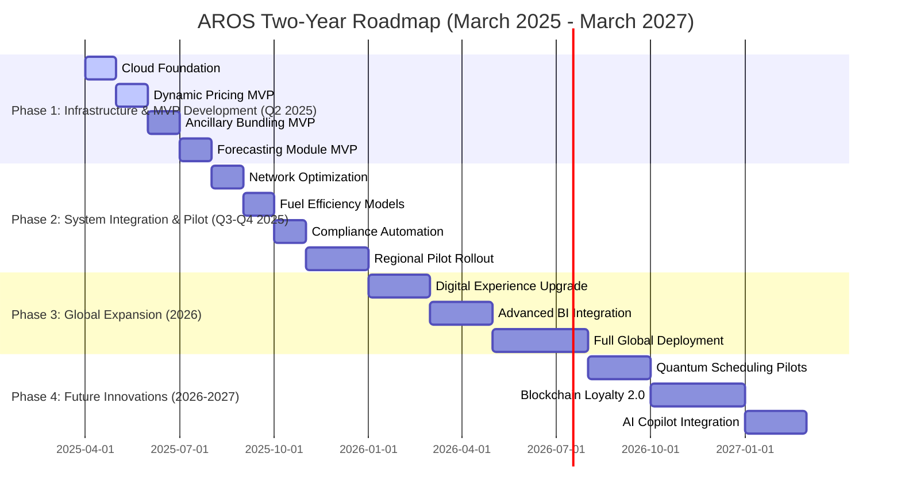

## Roadmap and Milestones

2 year roadmap for the Airline Revenue Optimization System (AROS). Each row in the table represents 2 sprints (4 weeks), detailing phase objectives, key activities, integrated epics, teams involved, dependencies, sprint goals & success metrics, deliverables, SAFe milestones, risks & mitigations, expected outcomes, and the achievement of all strategic objectives—delivering transformative improvements in airline revenie optimization.
[Detailed view](#roadmap)

### Two‑Year Roadmap Overview
| **Phase**                                         | **Timeframe (Months)** | **Milestones**                                                                                                                                                                                                                                                                                                                                                                     | **Outcome**                                                                                                             |
|---------------------------------------------------|------------------------|------------------------------------------------------------------------------------------------------------------------------------------------------------------------------------------------------------------------------------------------------------------------------------------------------------------------------------------------------------------------------------|-------------------------------------------------------------------------------------------------------------------------|
| **Phase 1: Infrastructure & MVP Development**   | 1–3                    | - **Infrastructure Setup:** Establish Kubernetes clusters, CI/CD pipelines, API Gateway, and service mesh. - **Pricing Engine MVP:** Develop and validate the dynamic pricing engine for 142 scenarios. - **Ancillary Module MVP:** Implement AI‑driven ancillary bundling for 110+ services. - **Forecasting & Network Optimization MVP:** Deploy and integrate demand forecasting models and simulation‑based network planning. - **Offer Management MVP:** Aggregate module outputs to generate final offers. | Fully operational MVP deployed in a staging environment with all core functionalities tested.                           |
| **Phase 2: Integration & Pilot Rollout**          | 3–6                    | - **Fuel Optimization Module:** Deploy predictive models to reduce fuel burn. - **Compliance & Security Automation:** Implement automated compliance controls and enhanced security measures. - **CI/CD & Operations Enhancements:** Refine deployment pipelines, auto‑scaling, and observability. - **Global Rollout Pilot Phase 1:** Pilot the MVP in select regions with full monitoring.              | Integrated system with validated fallback mechanisms and pilot performance confirming operational efficiency and revenue uplift. |
| **Phase 3: Expansion, Optimization & Digital Transformation** | 6–10                   | - **Digital Experience Enhancements:** Refine UI/UX for ancillary offers across mobile/web platforms. - **Advanced BI Integration:** Deploy unified dashboards and real‑time analytics for proactive decision‑making. - **Global Rollout Phase 2:** Scale deployment to additional regions and partners.                                                                                         | Improved customer engagement, higher conversion rates, and seamless global operations.                                   |
| **Phase 4: Future Innovations & Strategic Roadmap** | 10–24                  | - **Next‑Generation Innovation Kickoff:** Initiate R&D for quantum annealing, advanced blockchain loyalty, and enhanced predictive analytics. - **Advanced Analytics Expansion:** Scale up new AI models and further integrate BI tools. - **Continuous Improvement:** Establish regular review cycles to iterate on performance and cost optimization. - **Global Expansion:** Complete full‑scale global rollout with localized configurations and partner integrations. - **Final Roadmap Revision:** Finalize a strategic long‑term roadmap for next‑generation enhancements. | A future‑proof, continuously improving system that sustains high performance, regulatory compliance, and revenue growth globally.          |

### Roadmap

| **Timeframe (Sprints/Month)** | **Phase & Objectives**                                                                                                      | **Key Activities / Tasks**                                                                                                                                           | **Integrated Epics**                                       | **Teams Involved**                         | **Dependencies**                                     | **Sprint Goals & Success Metrics**                                                              | **Deliverables**                                   | **SAFe Milestones**                         | **Risks & Mitigations**                                                                                         | **Outcomes**                                               |
|-------------------------------|-----------------------------------------------------------------------------------------------------------------------------|---------------------------------------------------------------------------------------------------------------------------------------------------------------------|-----------------------------------------------------------|--------------------------------------------|-----------------------------------------------------|------------------------------------------------------------------------------------------------|---------------------------------------------------|--------------------------------------------|---------------------------------------------------------------------------------------------------------------|-------------------------------------------------------------|
| Sprints 1-2 (Month 1)         | **Infrastructure Setup & Cloud Foundation** Establish core cloud environment and CI/CD pipelines.                         | - Provision Kubernetes clusters using Terraform. - Configure API Gateway with OAuth2/JWT. - Set up service mesh (Istio) and basic monitoring.             | EPIC-6: Operational & Security Excellence                 | Engineering, DevOps, IT                    | Cloud provider readiness, network connectivity     | 100% infrastructure health; API response <200ms; successful automated health checks.           | Staging environment with basic services deployed   | MVP Infrastructure Setup                   | Misconfiguration risk mitigated via automated health checks and peer reviews.                                | Cloud foundation established; ready for module integration.   |
| Sprints 3-4 (Month 1)         | **Dynamic Pricing Engine (MVP)** Begin development of dynamic pricing engine with 142 scenarios.                          | - Develop core pricing logic (geo‑fencing, corporate discounts). - Integrate circuit breakers and caching. - Write initial unit tests.                    | EPIC-1: Dynamic Pricing Engine                             | Engineering, Data, QA                      | Access to historical pricing data                  | Achieve <200ms API response; 100% unit test pass rate for pricing scenarios.                    | MVP pricing engine module deployed                 | Pricing Module MVP                         | Data latency risk mitigated by caching, circuit breakers, and fallback dashboards.                          | Pricing engine operational and validated.                  |
| Sprints 5-6 (Month 2)         | **Ancillary Services Module (MVP)** Develop and test dynamic bundling for 110+ ancillary services.                         | - Develop AI-driven recommendation engine for bundling. - Integrate with CRM data for customer segmentation. - Create default bundle fallback.             | EPIC-2: Ancillary Services Module                          | Engineering, Marketing, QA, Product        | CRM data integration, partner API readiness         | Bundle generation accuracy >95%; fallback activation when CRM data is stale (<1 hr old).           | MVP ancillary bundling engine with test reports     | Ancillary Services MVP                     | Inconsistent API responses mitigated via Redis caching and default bundle triggers.                          | Ancillary module produces personalized bundles reliably.   |
| Sprints 7-8 (Month 2)         | **Forecasting Module (MVP)** Deploy a subset of 83 models for demand forecasting.                                        | - Deploy ARIMA and LSTM models. - Configure continuous retraining via AWS SageMaker. - Implement drift detection (KS-test).                                  | EPIC-3: Forecasting Module                                 | Data, Engineering, QA                      | Historical data, real-time data feeds               | Forecast accuracy ≥90% and MAPE reduction by 20%; automated retraining triggered on drift detection. | Deployed forecasting models with retraining scripts | Forecasting Module MVP                     | Risk of model drift mitigated via automated retraining and fallback to historical forecasts.                  | Reliable demand forecasts ready for integration.            |
| Sprints 9-10 (Month 3)        | **Network Optimization Module (MVP)** Develop simulation models for flight scheduling and inventory reallocation.           | - Develop Monte Carlo simulation for A380 rotations. - Integrate with pricing and forecasting outputs. - Validate against historical benchmarks.          | EPIC-4: Network Optimization Module                        | Engineering, Operations, Data              | Real-time operational data (ACARS), simulation tools | ≥10% reduction in delay cost; simulation outputs validated; fallback to FAA ASDI if data >15 min stale. | Initial network optimization module and simulation reports | Network Optimization MVP                  | Risk: Stale ACARS data mitigated by switching to FAA ASDI feed; simulation inaccuracies mitigated by historical calibration. | Optimized flight scheduling and inventory allocation demonstrated. |
| Sprints 11-12 (Month 3)       | **Offer Management System (MVP)** Integrate outputs from pricing, ancillary, and forecasting modules to generate final offers. | - Develop data merging algorithms using REST/GraphQL. - Validate offer generation with automated tests. - Integrate caching for fallback offers.          | EPIC-5: Offer Management System                            | Engineering, Product, QA, Marketing        | Complete module integrations; secure API endpoints    | Final offers generated with ≥99% success rate; integration tests pass; fallback activated on errors.                | MVP offer management system with end-to-end integration tests | Offer Management MVP                     | Risk: Integration failures mitigated by automated validations, caching, and rollback on failure.                | Unified offer management in operation with seamless data integration. |
| Sprints 13-14 (Month 4)       | **Fuel Optimization Module (MVP)** Deploy predictive models for fuel burn optimization and contrail avoidance.               | - Implement ARIMA, LSTM models for fuel consumption forecasting. - Integrate contrail avoidance model. - Validate using simulation and historical data. | EPIC-7: Fuel Optimization Module                           | Engineering, Sustainability, Data         | Reliable sensor data, satellite feeds               | Achieve 12% fuel savings in simulation; fallback to static burn rates if sensor data unavailable.                     | Fuel optimization models and simulation reports    | Fuel Optimization MVP                     | Risk: Sensor data delays mitigated by ECMWF backup; fallback to historical burn rates ensures continuity.        | Significant fuel savings achieved in simulation, ready for operational pilot. |
| Sprints 15-16 (Month 4)       | **Compliance & Security Automation** Automate enforcement of IATA NDC, GDPR, and CORSIA standards across the system.         | - Develop policy-as-code templates and integrate with CI/CD. - Implement automated vulnerability scanning and audit logging.                                   | EPIC-8: Compliance Automation                              | Engineering, Legal, Compliance, Security    | Up-to-date regulatory frameworks                    | 100% compliance in automated tests; zero critical vulnerabilities in security scans; audit logs complete.             | Automated compliance engine and security audit reports | Compliance Milestone Achieved             | Risk: Regulatory changes mitigated by dynamic policy-as-code updates and continuous monitoring.                  | Full compliance and secure operations validated.         |
| Sprints 17-18 (Month 5)       | **Operational Excellence & CI/CD Enhancement** Enhance system reliability, observability, and automated deployment processes.  | - Implement multi-region auto-scaling, service mesh integration. - Integrate centralized logging (Prometheus, Grafana, Jaeger). - Refine CI/CD pipelines. | EPIC-6: Operational & Security Excellence                  | Engineering, DevOps, Security, IT           | Cloud services, multi-region configuration          | Achieve system uptime of 99.99%; latency metrics and error rates within targets; successful automated deployments.        | Improved CI/CD pipelines, monitoring dashboards, and service mesh integration | Operational Excellence Milestone         | Risk: Cloud outages mitigated via multi-region deployment and failover; security issues mitigated with continuous scanning. | Highly resilient, automated, and secure system operations established. |
| Sprints 19-20 (Month 5)       | **Full End-to-End Integration Testing** Conduct comprehensive integration tests across all modules.                        | - Run end-to-end tests across Pricing, Ancillary, Forecasting, Network, and Offer Management. - Validate fallback mechanisms under simulated failures.    | EPIC-1, EPIC-2, EPIC-3, EPIC-4, EPIC-5                        | QA, Engineering, Product                   | Complete integration of all modules                  | 99% pass rate in integration tests; all fallback scenarios validated and automatically triggered when required.          | Integration test reports and system validation documentation | Integration Milestone Achieved           | Risk: Inter-module integration issues mitigated by automated tests and fallback to cached configurations.       | Fully integrated system ready for pilot rollout.          |
| Sprints 21-22 (Month 6)       | **Pilot Global Rollout (Phase 1)** Deploy the MVP in a controlled production environment with a subset of routes.             | - Roll out MVP to select regions. - Monitor real-time performance, gather feedback, and iterate.                                                               | EPIC-1, EPIC-2, EPIC-3, EPIC-4, EPIC-5, EPIC-6                 | Engineering, Operations, Marketing, Customer Support | Stable production data feeds; regulatory approvals      | Achieve ≥99.95% uptime; monitor KPIs (RASM uplift, OTP improvements); collect user feedback for adjustments.              | Production pilot release with full monitoring dashboards  | Pilot Rollout Milestone                  | Risk: Pilot performance deviations mitigated by rapid rollback and iterative improvements.                       | Successful pilot with validated revenue uplift and performance metrics. |
| Sprints 23-24 (Month 6)       | **Pilot Global Rollout (Phase 2)** Expand production rollout to additional routes and partners.                           | - Scale up deployment; integrate additional partner APIs. - Refine fallback strategies based on pilot data; optimize global data synchronization.           | EPIC-1, EPIC-2, EPIC-3, EPIC-4, EPIC-5, EPIC-6                 | Engineering, Operations, Marketing, Data     | Successful pilot completion; partner API stability    | Expand to >50% routes; achieve consistent performance metrics across regions; secure integration with all partners.         | Expanded production deployment; updated documentation and training materials | Global Rollout Phase 1 Complete           | Risk: Scaling challenges mitigated via automated scaling policies and continuous performance monitoring.           | Broad production rollout with improved global network and partner synchronization. |
| Sprints 25-26 (Month 7)       | **Enhance Customer Experience & Digital Touchpoints** Refine user interfaces and optimize mobile/web experience for ancillary offers. | - Enhance UI/UX based on pilot feedback; integrate real-time personalization in digital touchpoints; implement automated fallback UI for delays.            | EPIC-2: Ancillary Services EPIC-5: Offer Management          | UX, Marketing, Engineering, Product          | Feedback from pilot users; updated design standards    | Achieve >90% customer satisfaction (via surveys and NPS); seamless UX with <100ms UI latency; automated fallback UI activates if data delayed. | Updated web and mobile applications with enhanced personalization features | Digital Experience Milestone              | Risk: UI/UX inconsistencies mitigated via standardized design systems and continuous A/B testing.                    | Improved digital interfaces resulting in higher user engagement and conversion rates. |
| Sprints 27-28 (Month 7)       | **Advanced Analytics & BI Integration** Integrate real-time analytics dashboards and BI tools for continuous performance tracking. | - Develop dashboards using Power BI/Looker. - Integrate data from all modules into a unified data lake. - Set up automated reporting.                      | EPIC-3: Forecasting EPIC-6: Operational & Security Excellence  | Data, Engineering, Product, Marketing        | Unified data lake implementation; API integrations      | Dashboards display real-time KPIs (RASM, OTP, forecast accuracy); automated alerts trigger on deviations; BI reports generated weekly.         | Real-time analytics dashboards; automated BI reports             | BI Integration Milestone                 | Risk: Data integration issues mitigated by using ETL pipelines and real-time data validation; fallback to historical reports if live data fails.             | Comprehensive business insights enabling proactive decision-making.            |
| Sprints 29-30 (Month 8)       | **Security & Compliance Enhancements** Upgrade security controls and complete regulatory audits for full compliance.         | - Conduct full security audit; implement additional WAF and SIEM integration; ensure all modules meet updated IATA, GDPR, and CORSIA standards.                 | EPIC-8: Compliance Automation                                | Security, Engineering, Legal, Compliance       | Latest regulatory updates; security tool integrations  | 0 critical vulnerabilities; 100% compliance in simulated audits; automated alerts for any compliance deviations.                                 | Enhanced security controls, updated policy-as-code templates         | Security & Compliance Milestone         | Risk: New vulnerabilities mitigated by continuous vulnerability scanning and rapid patch deployment; fallback to hardened configurations if needed.       | Fully secure and compliant system meeting all regulatory requirements.            |
| Sprints 31-32 (Month 8)       | **Performance & Scalability Optimization** Fine-tune auto-scaling, load balancing, and overall system performance.           | - Stress-test the system at peak loads; optimize HPA settings; refine caching and rate limiting policies; conduct performance regression tests.                | EPIC-6: Operational & Security Excellence, EPIC-1: Dynamic Pricing | Engineering, DevOps, QA, IT                    | Stable load patterns; performance benchmark data        | System supports 5M concurrent users; API latency remains <200ms at peak loads; automated scaling triggers effectively under stress.              | Performance test reports; updated auto-scaling configurations       | Scalability Milestone                    | Risk: Over-provisioning or under-provisioning mitigated by real-time performance monitoring and auto-scaling adjustments; fallback to baseline configuration if needed. | Optimized performance under peak loads; scalability confirmed.                    |
| Sprints 33-34 (Month 9)       | **Global Rollout Preparation** Finalize system integration and prepare for full global deployment.                          | - Finalize end-to-end integration; complete final regression and security tests; document training and support processes; prepare for global marketing launch. | EPIC-5: Offer Management, EPIC-6: Operational & Security Excellence | All Departments (Product, Engineering, Ops, Marketing, QA, Data, Legal) | Successful performance, security, and integration tests | Complete system integration with 99.95% uptime; all key KPIs met; full documentation and training materials ready.                           | Final MVP release documentation, global rollout plan, training materials | Global Rollout Readiness Milestone       | Risk: Last-minute integration issues mitigated via pre-deployment regression and security tests; fallback procedures in place for rapid rollback if necessary. | Fully integrated system, certified for global deployment.                         |
| Sprints 35-36 (Month 9)       | **Phase 1 Global Rollout** Deploy system globally in select regions for initial full-scale operation.                        | - Roll out production deployment across targeted regions; monitor real-time performance; initiate feedback loops; ensure support teams are ready.              | EPIC-1, EPIC-2, EPIC-3, EPIC-4, EPIC-5, EPIC-6                 | Engineering, Ops, Marketing, Customer Support  | Final MVP readiness; partner integration complete        | Achieve 99.95% uptime globally; real-time KPIs meet or exceed targets; pilot feedback is collected and analyzed.                              | Global production deployment; performance and feedback reports        | Global Rollout Phase 1 Complete          | Risk: Regional deployment risks mitigated via multi-region strategy and rapid rollback procedures; fallback: revert to pilot environment if needed.          | Successful global operation in initial regions with validated performance improvements.         |
| Sprints 37-38 (Month 10)      | **Post-Rollout Optimization – Customer Experience Enhancements** Refine digital touchpoints and customer engagement based on rollout data.    | - Implement UI/UX improvements in mobile and web apps; optimize personalized offers; enhance feedback loop mechanisms; iterate on design based on real-world data.  | EPIC-2: Ancillary Services, EPIC-5: Offer Management             | UX, Marketing, Engineering, Product          | User feedback from global rollout                        | Customer satisfaction (NPS) >90%; UI response time <100ms; fallback UI mechanisms tested and validated.                                    | Updated digital interfaces; enhanced personalization features            | Digital Experience Milestone             | Risk: UI/UX inconsistencies mitigated by standardized design systems and continuous A/B testing; fallback: default UI templates if customizations fail.       | Enhanced customer engagement and higher conversion rates.                           |
| Sprints 39-40 (Month 10)      | **Post-Rollout Optimization – Advanced Analytics & BI** Integrate comprehensive analytics for ongoing performance tracking and optimization.   | - Develop advanced BI dashboards; integrate real-time analytics across all modules; automate reporting; conduct user training sessions for BI tools.         | EPIC-3: Forecasting, EPIC-6: Operational & Security Excellence   | Data, Engineering, Product, Marketing         | Unified data lake; BI tool readiness                      | Dashboards reflect real-time KPIs with automated alerts; user adoption metrics >80%; weekly reports generated with minimal manual intervention.             | BI dashboards, automated reporting systems, training materials             | BI & Analytics Milestone                | Risk: Data integration issues mitigated by ETL pipelines and real-time validation; fallback to historical data analysis if live data fails.                      | Comprehensive insights enabling proactive performance adjustments.                      |
| Sprints 41-42 (Month 11)      | **Security & Compliance Reassessment** Conduct full-scale security audits and regulatory compliance checks post-rollout.                      | - Perform comprehensive security audits; update vulnerability scans; ensure continuous compliance with IATA NDC, GDPR, and CORSIA; update policy-as-code templates as needed. | EPIC-8: Compliance Automation                                 | Security, Legal, Engineering, Compliance       | Final rollout data; updated regulatory frameworks         | Zero critical vulnerabilities; 100% compliance in audits; audit logs complete and verified.                                                     | Security audit reports, updated compliance policies, policy-as-code updates  | Security & Compliance Milestone         | Risk: Newly discovered vulnerabilities mitigated by immediate patching and rapid rollbacks; fallback: revert to hardened configurations.                        | Enhanced system security and confirmed regulatory compliance post-rollout.           |
| Sprints 43-44 (Month 11)      | **Scalability and Performance Stress Testing** Conduct rigorous stress and load testing to ensure system performance under peak conditions.      | - Execute performance stress tests simulating 5M concurrent users; optimize auto-scaling and load balancing configurations; adjust HPA settings as necessary.   | EPIC-6: Operational & Security Excellence, EPIC-1: Dynamic Pricing | Engineering, DevOps, QA                        | Performance benchmarks from previous sprints; cloud resource availability    | Achieve <200ms latency under peak load; system scales seamlessly; auto-scaling triggers as expected; no performance degradation.                           | Stress test reports, updated auto-scaling policies, load balancing configurations | Scalability & Performance Milestone    | Risk: Over- or under-provisioning mitigated by real-time monitoring and dynamic adjustments; fallback: revert to baseline configuration if necessary.         | Fully scalable system with robust performance under peak conditions.                  |
| Sprints 45-46 (Month 12)      | **Global Rollout Phase 2 & Continuous Improvement** Expand global deployment, refine systems based on feedback, and ensure long-term optimization.  | - Expand deployment to all regions; implement continuous improvement processes; integrate advanced analytics feedback; conduct iterative enhancements.        | All Epics (1-8)                                             | All Departments                              | Final integration and pilot success; full partner network availability          | Global deployment with 99.99% uptime; continuous improvement cycle in place; revenue KPIs and customer satisfaction metrics exceed targets.                 | Fully deployed global system, continuous improvement framework, comprehensive documentation updates  | Global Rollout Complete, Continuous Improvement Milestone | Risk: Scaling or regional challenges mitigated by multi-cloud, auto-scaling, and proactive support; fallback: segmented rollouts with region-specific adjustments. | Achieve full-scale global operation with sustained performance, revenue uplift, and high customer satisfaction. |
| Sprints 47-48 (Month 12)      | **Post-Rollout Optimization – Final Review & Future Roadmap Planning** Evaluate performance, finalize lessons learned, and plan future enhancements. | - Conduct a comprehensive post-rollout review; compile performance, security, and customer feedback; update the future roadmap; prepare executive reports.     | All Epics                                                 | All Departments                              | Global rollout completion; complete performance data                          | Final reports with actionable insights; roadmap updated with next-phase enhancements; executive sign-off obtained.                                      | Final post-rollout report, updated future roadmap, executive presentation              | Final Project Sign-Off, Next-Phase Roadmap | Risk: Incomplete data or biased feedback mitigated by cross-departmental reviews and independent audits; fallback: schedule follow-up reviews if necessary.  | Clear insights and a well-defined roadmap for future enhancements, ensuring continuous innovation and system resilience. |
| Sprints 49-50 (Month 13)      | **Expansion of Advanced Analytics & AI Capabilities** Incorporate new predictive models and advanced analytics to further drive RASM improvements.   | - Research and deploy additional AI models (e.g., federated learning, counterfactual analysis). - Update BI dashboards to incorporate new KPIs.            | EPIC-3: Forecasting, EPIC-6: Operational & Security Excellence   | Data, Engineering, Product, Marketing         | Continued R&D results; partner research collaborations                     | Demonstrate additional 1-2% revenue uplift; improve model interpretability; new KPIs integrated into dashboards.                                          | New predictive models, updated dashboards, performance reports                             | Advanced Analytics Milestone            | Risk: Integration challenges with new models mitigated by incremental deployment and extensive testing; fallback: gradual rollout with pilot groups.        | Enhanced analytics capabilities lead to further revenue improvements and deeper business insights.  |
| Sprints 51-52 (Month 13)      | **Refinement of Customer Engagement & Digital Transformation** Enhance digital touchpoints and personalized experiences based on advanced AI insights. | - Refine mobile and web UI for ancillary offers; implement real-time personalization using AI; optimize customer feedback loops; conduct A/B tests.           | EPIC-2: Ancillary Services, EPIC-5: Offer Management               | UX, Marketing, Engineering, Product          | Customer engagement data; feedback from post-rollout surveys                | Improve NPS and CSAT by at least 10%; reduce bounce rates; UI latency remains <100ms; successful A/B test results for personalized offers.                | Updated digital interfaces, personalized offer engines, detailed customer feedback reports     | Digital Transformation Milestone       | Risk: UI/UX inconsistencies mitigated by iterative design and A/B testing; fallback: revert to previous stable version if performance degrades.           | Enhanced customer experience, leading to higher conversion rates and increased ancillary revenue.  |
| Sprints 53-54 (Month 14)      | **Operational Efficiency & Cost Optimization** Focus on reducing operational costs and enhancing system efficiency through process improvements.   | - Optimize network planning algorithms; refine inventory reallocation processes; enhance automation in operational tasks; implement advanced cost analytics.   | EPIC-4: Network Optimization, EPIC-7: Fuel Optimization             | Operations, Engineering, Data, Sustainability  | Performance data from previous phases; cost benchmarks                        | Achieve further 2-3% cost savings; operational KPIs (e.g., OTP) improve by 5%; successful automation of key processes verified.                       | Updated algorithms, cost analytics dashboards, operational improvement reports                | Operational Efficiency Milestone       | Risk: Cost fluctuations mitigated by continuous monitoring and automated adjustments; fallback: use historical cost data to guide decision-making.       | Increased operational efficiency and reduced costs, leading to higher profitability.                 |
| Sprints 55-56 (Month 14)      | **Enhancement of Compliance & Audit Processes** Strengthen automated compliance, audit trails, and regulatory monitoring for continuous improvement. | - Update policy-as-code templates; enhance automated vulnerability scanning; implement continuous compliance monitoring dashboards; conduct full audits.     | EPIC-8: Compliance Automation                                   | Legal, Engineering, Compliance, Security      | Regulatory updates; audit feedback from previous cycles                     | 100% compliance achieved in audits; zero critical vulnerabilities detected; comprehensive audit trails maintained; compliance dashboards active.         | Updated compliance policies, audit reports, automated monitoring dashboards                   | Compliance Enhancement Milestone       | Risk: Regulatory changes mitigated by dynamic policy updates; fallback: trigger manual review processes automatically if non-compliance is detected.    | Strengthened regulatory compliance and enhanced security posture across the system.                 |
| Sprints 57-58 (Month 15)      | **Future-Proofing & Strategic Roadmap Revision** Review current performance, integrate lessons learned, and update the long-term roadmap for next-generation enhancements. | - Conduct cross-functional reviews; compile performance, security, and customer feedback; update strategic roadmaps; prepare executive reports and future proposals. | All Epics                                                     | All Departments                              | Complete performance data from rollout; cross-department reviews              | Final executive sign-off on current phase; updated long-term roadmap with clear next-phase objectives; feedback integrated into strategic planning.     | Final post-rollout review report, updated future roadmap, executive presentation                | Strategic Roadmap Milestone            | Risk: Incomplete data mitigated by thorough cross-functional reviews; fallback: schedule follow-up reviews if critical data is missing.                   | Clear, strategic long-term roadmap for next-generation enhancements, ensuring continuous innovation.  |
| Sprints 59-60 (Month 15)      | **Next-Generation Innovation Kickoff** Initiate projects for next-gen technologies (e.g., quantum annealing, enhanced blockchain loyalty) and advanced analytics. | - Begin R&D projects for next-gen pricing and scheduling models; prototype quantum annealing pilots; explore enhanced blockchain loyalty mechanisms; conduct feasibility studies. | EPIC-1: Dynamic Pricing, EPIC-2: Ancillary Services, EPIC-8: Compliance Automation | R&D, Engineering, Product, Data             | Funding approvals; initial R&D findings; collaboration with tech partners       | Successful prototype demonstrations; feasibility reports completed; initial proof-of-concept validated.                                                   | Prototypes, feasibility studies, initial proof-of-concept documentation                         | Next-Gen Innovation Kickoff            | Risk: High R&D risk mitigated by pilot testing and incremental innovation; fallback: maintain current systems while iterating on new technologies.     | Established foundation for next-gen innovations, with prototypes to drive future revenue uplift.         |
| Sprints 61-62 (Month 16)      | **Expansion of Advanced Analytics Capabilities** Scale up advanced predictive models and refine BI integration for deeper insights.                  | - Integrate federated learning and counterfactual analysis models; update BI dashboards; enhance real-time analytics and reporting; train end users.            | EPIC-3: Forecasting, EPIC-6: Operational & Security Excellence     | Data, Engineering, Product, Marketing         | Results from next-gen innovation pilots; BI tool integrations; unified data lake               | Additional revenue uplift of 1-2%; improved model interpretability; real-time BI dashboards with >80% user adoption; weekly automated reports.       | Updated predictive models, advanced BI dashboards, user training materials                      | Advanced Analytics Expansion           | Risk: Integration challenges mitigated by phased rollouts and extensive testing; fallback: revert to previous model versions if integration issues arise. | Enhanced analytics capabilities leading to deeper business insights and further revenue optimization.  |
| Sprints 63-64 (Month 16)      | **Global System Stabilization & Optimization** Ensure system stability, security, and optimal performance across all regions globally.            | - Finalize and optimize all modules; perform full-scale global stress and security tests; validate multi-region failover; update disaster recovery plans.    | EPIC-6: Operational & Security Excellence, All other Epics            | All Departments                              | Final integration results; global performance benchmarks; updated security policies            | Achieve 99.99% uptime, <200ms API latency globally; all security audits passed; disaster recovery plans verified.                                    | Final global deployment report, updated disaster recovery plans, security audit reports            | Global Stabilization Milestone         | Risk: Global integration issues mitigated by robust multi-region deployments and rigorous stress testing; fallback: segmented rollouts with regional adjustments. | Fully stable, secure, and globally optimized system deployed with all KPIs met.                        |
| Sprints 65-66 (Month 17)      | **Post-Deployment Continuous Improvement** Implement a continuous improvement process driven by AI analytics and customer feedback.              | - Establish regular update cycles; integrate automated feedback loops; refine models and processes based on real-time analytics; conduct quarterly reviews.  | All Epics                                                     | Product, Engineering, Data, Operations, Marketing | Continuous data collection; established feedback mechanisms; stakeholder input                 | Continuous improvement framework in place; measurable incremental improvements (e.g., 1-2% revenue uplift per quarter).                             | Quarterly improvement reports, updated system configurations, feedback integration documentation  | Continuous Improvement Milestone       | Risk: Feedback loops failing mitigated by automated monitoring and redundant data sources; fallback: use historical improvement trends for updates.  | Ongoing performance enhancements, increased customer satisfaction, and revenue growth confirmed over time. |
| Sprints 67-68 (Month 17)      | **Expansion into New Markets & Partnerships** Scale the solution to additional markets and integrate new partner channels globally.             | - Identify new market opportunities; onboard additional airline partners; integrate new partner APIs; localize the system for regional compliance.           | EPIC-5: Offer Management, EPIC-2: Ancillary Services                  | Product, Sales, Engineering, Legal             | Market research; partner API availability; local regulatory requirements                        | Expansion to at least 3 new regional markets; partner integration success rate ≥95%; localized compliance achieved.                                 | New market rollout plans, partner integration reports, localized system configurations              | Market Expansion Milestone             | Risk: Regional regulatory differences mitigated via localized compliance teams and modular system design; fallback: phased rollout with pilot regions. | Successful expansion into new markets with strong partner integrations and local compliance.             |
| Sprints 69-70 (Month 18)      | **Strategic Innovation & Future Roadmap Revision** Review strategic achievements, update long-term roadmap, and plan next-generation features.    | - Conduct a comprehensive strategic review; update future roadmap based on performance data and market trends; hold executive workshops; document lessons learned. | All Epics                                                     | All Departments                              | Complete performance data; cross-functional review sessions                                      | Final executive sign-off on current phase; updated long-term roadmap with new strategic initiatives; detailed lessons learned report.                  | Strategic review report, updated future roadmap, executive presentation                           | Strategic Roadmap Revision             | Risk: Incomplete data or biased feedback mitigated by independent audits and cross-departmental reviews; fallback: schedule additional review cycles if necessary. | Clear, forward-looking roadmap that aligns with market trends and future technology integrations.        |
| Sprints 71-72 (Month 18)      | **Next-Generation Pilot Launch** Kick off pilots for next-gen technologies (quantum annealing, enhanced blockchain loyalty) and advanced analytics. | - Deploy pilot projects for quantum annealing-based scheduling and enhanced blockchain loyalty; conduct feasibility studies and initial prototyping; gather pilot data. | EPIC-1: Dynamic Pricing, EPIC-2: Ancillary Services, EPIC-8: Compliance Automation | R&D, Engineering, Product, Data             | Funding approvals; initial pilot feedback; tech partner collaboration                             | Successful pilot demonstrations; prototypes meet proof-of-concept criteria; initial ROI estimates; pilot feedback >80% positive.                     | Pilot project prototypes, feasibility reports, initial performance metrics                        | Next-Gen Innovation Kickoff            | Risk: High R&D risk mitigated by incremental deployment and controlled pilot groups; fallback: maintain current systems while iterating on new technologies. | Foundation for next-gen innovations established, with validated prototypes driving future revenue improvements. |
| Sprints 73-74 (Month 19)      | **Advanced Data Integration & Unified BI Platform** Enhance data integration and build a unified BI dashboard for executive analytics.           | - Integrate all modules’ data into a unified data lake; build advanced BI dashboards (using Power BI/Looker); automate weekly performance reports; train users. | EPIC-3: Forecasting, EPIC-6: Operational & Security Excellence         | Data, Engineering, Product, Marketing         | Unified data lake availability; BI tool readiness; stable API integrations                            | Dashboards reflect real-time KPIs; >80% user adoption; weekly automated reports; accuracy verified by cross-checks.                                  | Unified BI dashboards, automated reports, training sessions                                  | BI & Analytics Expansion               | Risk: Data integration challenges mitigated by robust ETL pipelines and real-time data validation; fallback: revert to historical data analysis if necessary.  | Comprehensive, unified analytics delivering deep insights for proactive decision-making.                |
| Sprints 75-76 (Month 19)      | **Customer Experience & Digital Transformation Refinement** Refine UI/UX and further personalize customer engagement based on new analytics insights. | - Implement iterative design improvements in mobile/web interfaces; integrate advanced personalization algorithms; enhance feedback loops; A/B test new features. | EPIC-2: Ancillary Services, EPIC-5: Offer Management                      | UX, Marketing, Engineering, Product          | Continuous user feedback; stable analytics integration; updated design system                           | Improved NPS >10% uplift; UI response time <100ms; successful A/B testing results; increased engagement and conversion metrics.                        | Updated digital interfaces, new personalized modules, detailed A/B testing reports                  | Digital Experience Enhancement         | Risk: UX inconsistencies mitigated by standardized design and continuous A/B testing; fallback: revert to previous stable design if issues arise.           | Enhanced digital touchpoints driving increased customer satisfaction and revenue uplift.               |
| Sprints 77-78 (Month 20)      | **Operational Efficiency & Cost Optimization** Further optimize network planning and fuel optimization to reduce costs and improve OTP.          | - Refine network simulation models and inventory allocation; enhance fuel burn prediction models; integrate additional cost analytics; update operational processes. | EPIC-4: Network Optimization, EPIC-7: Fuel Optimization                    | Operations, Engineering, Data, Sustainability   | Performance data from prior phases; updated cost benchmarks; stable integration with operational data feeds                | Achieve additional 2-3% cost savings; OTP improvements by 5%; validated reduction in operational delays; automated process improvements documented.    | Updated network and fuel optimization models, cost analytics dashboards, process improvement reports   | Operational Efficiency Enhancement     | Risk: Fluctuating fuel costs mitigated by real-time analytics and fallback to historical benchmarks; fallback: trigger manual reviews if discrepancies occur. | Further reduced operational costs and improved on-time performance, driving overall efficiency.       |
| Sprints 79-80 (Month 20)      | **Expansion into New Markets & Strategic Partnerships** Scale the solution to additional regions and onboard new airline partners globally.         | - Identify target markets; onboard additional airline partners; integrate new partner APIs; ensure localization and regulatory compliance; coordinate market-specific rollouts. | EPIC-5: Offer Management, EPIC-2: Ancillary Services                      | Product, Sales, Engineering, Legal            | Market research; partner API availability; local regulatory approvals                                 | Expansion to at least 3 new regions; partner integration success rate ≥95%; localized compliance achieved; positive market feedback.               | New market rollout plans, partner integration reports, localized system configurations             | Market Expansion Milestone             | Risk: Regional regulatory differences mitigated by localized compliance strategies and phased rollout; fallback: pilot rollout before full expansion.  | Successful expansion with strong partner integrations and local compliance in new markets.            |
| Sprints 81-82 (Month 21)      | **Post-Rollout Continuous Improvement & System Optimization** Establish continuous improvement cycles and fine-tune the entire system.           | - Implement a continuous improvement process; schedule quarterly reviews; integrate real-time feedback loops; update system components and processes accordingly. | All Epics                                                     | All Departments                              | Consistent data collection; stakeholder feedback; established performance benchmarks                                   | Quarterly improvement reports with measurable KPIs (e.g., revenue uplift, improved OTP, reduced costs); iterative system updates.                 | Quarterly improvement documentation, updated system configurations, executive review reports          | Continuous Improvement Milestone       | Risk: Insufficient feedback mitigated by automated data collection and independent audits; fallback: use historical trends to guide updates.             | Ongoing performance enhancements, higher customer satisfaction, and revenue growth over time.           |
| Sprints 83-84 (Month 21)      | **Security, Compliance & Disaster Recovery Enhancement** Strengthen security, ensure compliance, and improve disaster recovery plans.          | - Upgrade security controls; perform full-scale security audits; update disaster recovery strategies; implement additional failover mechanisms; test recovery scenarios. | EPIC-8: Compliance Automation, EPIC-6: Operational & Security Excellence    | Security, Engineering, Legal, Compliance        | Latest regulatory updates; integration with security tools; updated disaster recovery plans                              | Zero critical vulnerabilities; 100% compliance in simulated audits; disaster recovery tests complete with RPO ≤15s and RTO ≤60s.                 | Security audit reports, updated disaster recovery plans, compliance dashboards                      | Security & Disaster Recovery Milestone | Risk: New security threats mitigated by continuous monitoring and rapid patch deployment; fallback: revert to hardened baseline configurations if necessary. | Enhanced security and disaster recovery posture, ensuring full compliance and system resilience.      |
| Sprints 85-86 (Month 22)      | **Next-Generation Innovation & Future Roadmap Planning** Initiate next-gen projects (quantum annealing, advanced blockchain loyalty) and update the long-term roadmap. | - Kick off R&D for next-gen technologies; deploy pilot projects; gather data; hold cross-functional workshops; update strategic roadmap.                       | EPIC-1: Dynamic Pricing, EPIC-2: Ancillary Services, EPIC-8: Compliance Automation | R&D, Engineering, Product, Data, Marketing     | Funding approvals; initial R&D results; collaboration with technology partners                                        | Successful prototypes demonstrating next-gen features; updated roadmap with new strategic initiatives; executive sign-off on future innovations. | Next-gen innovation prototypes, updated long-term roadmap, feasibility reports                          | Next-Gen Innovation Kickoff            | Risk: High R&D risk mitigated by controlled pilot testing and phased rollouts; fallback: maintain current systems while iterating on new technologies. | Foundation for next-gen innovations established, paving the way for future revenue growth and operational enhancements.  |
| Sprints 87-88 (Month 22)      | **Advanced Analytics & Predictive Insights Expansion** Enhance BI capabilities and integrate advanced analytics for deeper operational insights.   | - Expand predictive models (federated learning, counterfactual analysis); integrate additional KPIs into BI dashboards; automate complex reporting; train users.   | EPIC-3: Forecasting, EPIC-6: Operational & Security Excellence               | Data, Engineering, Marketing, Product          | Unified data lake; advanced BI tool integrations; robust ETL pipelines                                                   | Additional revenue uplift of 1-2%; improved model interpretability; dashboards with >80% user adoption; comprehensive weekly automated reports.    | Updated advanced predictive models, enhanced BI dashboards, user training sessions                      | Advanced Analytics Expansion Milestone | Risk: Data integration challenges mitigated by phased rollout and fallback to historical data analysis if live data fails.          | Enhanced analytics leading to deeper insights, enabling proactive system and revenue optimizations.     |
| Sprints 89-90 (Month 23)      | **Customer Engagement & Digital Transformation Refinement** Further personalize digital touchpoints based on advanced analytics insights.         | - Refine web/mobile UI for ancillary offers; implement additional personalization algorithms; enhance customer feedback loops; conduct extensive A/B testing.   | EPIC-2: Ancillary Services, EPIC-5: Offer Management                       | UX, Marketing, Engineering, Product             | Feedback data from global rollout; updated design standards; robust analytics integration                                    | Increased customer satisfaction (NPS uplift >10%); UI latency <100ms; higher conversion rates; successful A/B test outcomes.                             | Updated digital interfaces, new personalized modules, detailed A/B testing reports                      | Digital Experience Enhancement         | Risk: UI/UX inconsistencies mitigated by iterative design improvements and continuous A/B testing; fallback: revert to previous stable versions if necessary. | Enhanced customer engagement and digital experience, leading to improved revenue and satisfaction.     |
| Sprints 91-92 (Month 23)      | **Operational Cost & Efficiency Optimization** Refine network planning and operational processes to further reduce costs and improve OTP.         | - Optimize scheduling and inventory reallocation models; enhance fuel optimization algorithms; refine operational workflows; update cost analytics.            | EPIC-4: Network Optimization, EPIC-7: Fuel Optimization                     | Operations, Engineering, Data, Sustainability    | Performance data from previous phases; updated cost benchmarks; stable data feeds                                               | Achieve additional 2-3% cost savings; OTP improvement by 5%; validated reduction in delays; improved efficiency KPIs documented.                         | Refined models and processes, updated cost analytics dashboards, operational improvement reports         | Efficiency Optimization Milestone      | Risk: Operational fluctuations mitigated via real-time analytics and automated adjustments; fallback: revert to historical benchmarks if performance declines. | Further reduced operational costs and improved on-time performance, driving increased profitability.   |
| Sprints 93-94 (Month 24)      | **Global Expansion & Market Penetration** Finalize global rollout, expand to new regions, and integrate additional partner channels.             | - Scale system globally; onboard additional airline partners; integrate new partner APIs; ensure localized compliance; conduct regional pilot rollouts.       | EPIC-5: Offer Management, EPIC-2: Ancillary Services                        | Product, Sales, Engineering, Legal              | Market research; partner API readiness; local regulatory requirements                                                         | Expansion to all target regions; ≥95% partner integration success rate; localized compliance achieved; positive market feedback confirmed.         | Full global deployment; partner integration reports, localized configurations, market expansion plans                    | Global Rollout Complete                | Risk: Regional regulatory differences mitigated by localized compliance strategies and phased rollouts; fallback: pilot new regions before full expansion. | Successful global expansion with strong partner integrations and full regional compliance, driving overall revenue growth.  |
| Sprints 95-96 (Month 24)      | **Final System Stabilization & Strategic Roadmap Revision** Conduct final system reviews, validate performance, and update the roadmap for next-gen enhancements. | - Perform comprehensive post-rollout reviews; compile performance, security, and customer feedback; update long-term roadmap; prepare executive summary and next-phase proposals. | All Epics                                                     | All Departments                                 | Global deployment data; cross-department review sessions; independent audits                                                  | Final system performance meets all KPIs (99.99% uptime, <200ms latency, compliance achieved); updated strategic roadmap with next-gen initiatives approved. | Final post-rollout review report, updated long-term roadmap, executive presentation                    | Final Project Sign-Off, Next-Phase Roadmap | Risk: Incomplete data or biased feedback mitigated by independent audits and cross-functional reviews; fallback: schedule additional review cycles if needed. | Clear, validated, and future-proof strategic roadmap established, ensuring continuous innovation and system excellence. |
