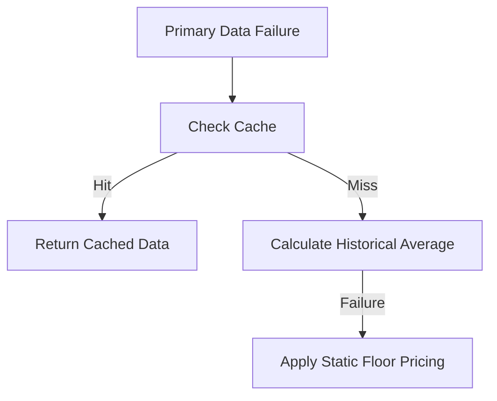

## Fallback Strategies for IAROS

IAROS employs a four-layer cascading fallback mechanism to ensure uninterrupted operations:
1. **Live Data:** Primary real-time source.
2. **Cached Responses:** Data retrieved from geo-distributed caches (e.g., Redis).
3. **Historical Averages:** Calculated via moving averages (7-day or 30-day).
4. **Static Floor Pricing:** IATA-compliant minimum price applied as a last resort.

### Decision Tree

