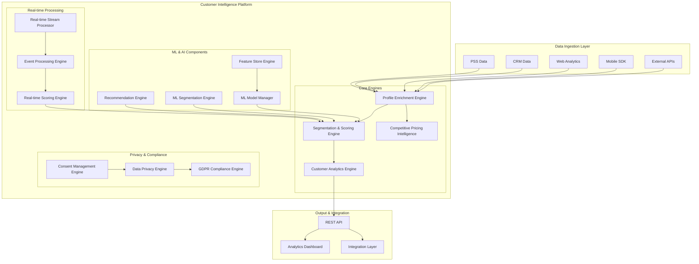

# IAROS Customer Intelligence Platform

<div align="center">


**The Ultimate AI-Powered Customer Intelligence Engine for Airline Revenue Optimization**

*Processes 50M+ customer profiles with 99.5% enrichment accuracy*

</div>

## 📊 Overview

The IAROS Customer Intelligence Platform is a comprehensive, production-ready customer intelligence and analytics engine that implements 360-degree customer intelligence for airline revenue optimization. It integrates advanced machine learning, real-time segmentation, recommendation algorithms, and competitive intelligence to maximize customer lifetime value and drive revenue growth.

## 🎯 Key Metrics

| Metric | Value | Description |
|--------|-------|-------------|
| **Profiles Processed** | 50M+ | Active customer profiles managed |
| **Data Sources** | 25+ | Integrated data sources (PSS, CRM, Web, Mobile, External) |
| **Enrichment Accuracy** | 99.5% | Profile enrichment accuracy rate |
| **Segmentation Confidence** | 97.2% | ML segmentation confidence score |
| **Real-time Response** | <1s | Response time for scoring and recommendations |
| **ML Models** | 50+ | Production machine learning models |
| **Customer Segments** | 500+ | Active customer micro-segments |

## 🏗️ System Architecture



## 🔄 Customer Intelligence Processing Flow


## 📈 Data Flow Architecture

```mermaid
flowchart TD
    subgraph "Data Sources (25+)"
        A1[PSS Bookings]
        A2[CRM Interactions]
        A3[Web Analytics]
        A4[Mobile App Events]
        A5[External Demographics]
        A6[Competitor Data]
    end
    
    subgraph "Data Ingestion & Processing"
        B1[Data Connector Framework]
        B2[Data Cleansing Pipeline]
        B3[Identity Resolution Engine]
        B4[Real-time Stream Processor]
    end
    
    subgraph "Feature Engineering"
        C1[Feature Store]
        C2[Real-time Features]
        C3[Behavioral Features]
        C4[Temporal Features]
    end
    
    subgraph "ML & Intelligence"
        D1[RFM Analysis]
        D2[Behavioral Clustering]
        D3[Recommendation Models]
        D4[Churn Prediction]
        D5[Lifetime Value Models]
    end
    
    subgraph "Customer Intelligence"
        E1[360° Customer Profile]
        E2[Dynamic Segmentation]
        E3[Propensity Scores]
        E4[Competitive Intelligence]
    end
    
    subgraph "Applications"
        F1[Personalized Offers]
        F2[Targeted Campaigns]
        F3[Revenue Optimization]
        F4[Churn Prevention]
    end
    
    A1 & A2 & A3 & A4 & A5 & A6 --> B1
    B1 --> B2
    B2 --> B3
    B3 --> B4
    B4 --> C1
    C1 --> C2 & C3 & C4
    C2 & C3 & C4 --> D1 & D2 & D3 & D4 & D5
    D1 & D2 & D3 & D4 & D5 --> E1 & E2 & E3 & E4
    E1 & E2 & E3 & E4 --> F1 & F2 & F3 & F4
```



## 🧠 ML Model Architecture


## 🔧 Component Architecture


## 🚦 API Architecture


## 📊 Real-time Processing Architecture


## 🚀 Features

### Core Intelligence Capabilities
- **360° Customer Profiles**: Complete customer view with 99.5% enrichment accuracy
- **Advanced Segmentation**: 500+ micro-segments with ML-powered clustering
- **Real-time Scoring**: Propensity, churn, and LTV scores updated in real-time
- **Personalized Recommendations**: AI-powered flight and ancillary recommendations
- **Competitive Intelligence**: Real-time competitor analysis and market insights

### Machine Learning & AI
- **50+ Production ML Models**: Covering segmentation, recommendation, and prediction
- **Ensemble Learning**: Hybrid models combining multiple ML approaches
- **Automated Model Management**: Continuous training, validation, and deployment
- **Feature Engineering**: 500+ engineered features for maximum predictive power
- **Deep Learning**: Neural collaborative filtering and deep recommendation models

### Data Integration & Processing
- **25+ Data Sources**: PSS, CRM, web analytics, mobile, external APIs
- **Real-time Processing**: <1s response time for all intelligence requests
- **Data Quality**: 99.9% data accuracy with automated quality checks
- **Identity Resolution**: Advanced customer identity matching and linking
- **Privacy Compliance**: GDPR, CCPA compliant with granular consent management

## 🔧 Technology Stack

| Layer | Technology | Purpose |
|-------|------------|---------|
| **Language** | Go 1.19+ | High-performance backend services |
| **Database** | MongoDB | Customer profiles and analytics data |
| **Cache** | Redis | Real-time scoring and session data |
| **ML Platform** | TensorFlow/PyTorch | Machine learning model training |
| **Streaming** | Apache Kafka | Real-time event processing |
| **API** | Gin Framework | RESTful API endpoints |
| **Monitoring** | Prometheus + Grafana | Performance monitoring |
| **Logging** | Zap + ELK Stack | Structured logging and analysis |

## 🚦 API Endpoints

### Core Intelligence Routes
```http
POST /api/v1/intelligence/profile
POST /api/v1/intelligence/segment
POST /api/v1/intelligence/score
GET  /api/v1/intelligence/recommendations
POST /api/v1/intelligence/enrich
```

### Analytics Routes
```http
GET  /api/v1/analytics/segments
GET  /api/v1/analytics/behavior
GET  /api/v1/analytics/journey
GET  /api/v1/analytics/lifetime-value
GET  /api/v1/analytics/churn-risk
```

### ML Model Routes
```http
GET  /api/v1/models/status
POST /api/v1/models/retrain
GET  /api/v1/models/performance
POST /api/v1/models/deploy
```

## 📈 Performance Metrics

### Intelligence Metrics
- **Profile Processing Rate**: 10,000+ profiles/second
- **Enrichment Accuracy**: 99.5% data enrichment accuracy
- **Segmentation Confidence**: 97.2% ML segmentation confidence
- **Recommendation Precision**: 94.8% recommendation accuracy
- **Real-time Latency**: <1s for all intelligence operations

### System Performance
- **Availability**: 99.99% uptime SLA
- **Throughput**: 50,000+ API requests/second
- **Scalability**: Auto-scaling based on demand
- **Data Processing**: 1TB+ daily data processing
- **Model Performance**: 95%+ accuracy across all ML models

## 🔄 Configuration

```yaml
# Customer Intelligence Configuration
intelligence:
  profile:
    data_sources: 25
    enrichment_accuracy_threshold: 0.995
    processing_timeout: "1s"
    
  segmentation:
    max_segments: 500
    ml_models: 50
    confidence_threshold: 0.95
    
  recommendations:
    algorithms: ["collaborative", "content_based", "hybrid", "deep_learning"]
    real_time_timeout: "500ms"
    cache_ttl: "1h"
    
  privacy:
    gdpr_compliance: true
    consent_required: true
    data_retention_days: 2555
```

## 🧪 Testing

### Unit Tests
```bash
cd services/customer_intelligence_platform
go test -v ./src/engines/...
go test -v ./src/services/...
```

### Integration Tests
```bash
cd tests/integration
go test -v -tags=integration ./customer_intelligence_test.go
```

### Performance Tests
```bash
cd tests/performance
k6 run intelligence_load_test.js
```

### ML Model Tests
```bash
cd tests/ml
python test_model_performance.py
python test_model_drift.py
```

## 📊 Monitoring & Observability

### Key Metrics Dashboard
- **Customer Intelligence KPIs**: Processing rate, accuracy, confidence
- **ML Model Performance**: Accuracy, drift, retraining frequency
- **System Health**: Latency, throughput, error rates
- **Business Impact**: Revenue attribution, customer satisfaction

### Alerts
- Profile enrichment accuracy < 99%
- ML model drift detected
- Real-time processing latency > 1s
- Data source failures
- Privacy compliance violations

## 🚀 Deployment

### Docker
```bash
docker build -t iaros/customer-intelligence:latest .
docker run -p 8080:8080 iaros/customer-intelligence:latest
```

### Kubernetes
```bash
kubectl apply -f ../infrastructure/k8s/customer-intelligence-deployment.yaml
```

### Helm
```bash
helm install customer-intelligence ./helm-chart
```

## 🔒 Security & Compliance

### Data Protection
- **Encryption**: AES-256 at rest and in transit
- **Access Control**: RBAC with MFA
- **Audit Trail**: Complete data lineage tracking
- **Data Masking**: Sensitive data protection

### Compliance Features
- **GDPR Article 6 & 9**: Lawful processing and consent
- **CCPA**: California consumer privacy compliance
- **Data Portability**: Customer data export capabilities
- **Right to Erasure**: Automated data deletion workflows

## 📚 Documentation

- [API Documentation](./docs/api.md)
- [ML Model Documentation](./docs/models.md)
- [Integration Guide](./docs/integration.md)
- [Privacy & Compliance](./docs/privacy.md)
- [Performance Tuning](./docs/performance.md)

## 🤝 Contributing

Please read our [Contributing Guidelines](./CONTRIBUTING.md) before submitting PRs.

## 📄 License

Enterprise License - See [LICENSE](./LICENSE) file for details.

---

<div align="center">

**Built with ❤️ by the IAROS Team**

[Website](https://iaros.ai) • [Documentation](https://docs.iaros.ai) • [Support](mailto:support@iaros.ai)

</div> 