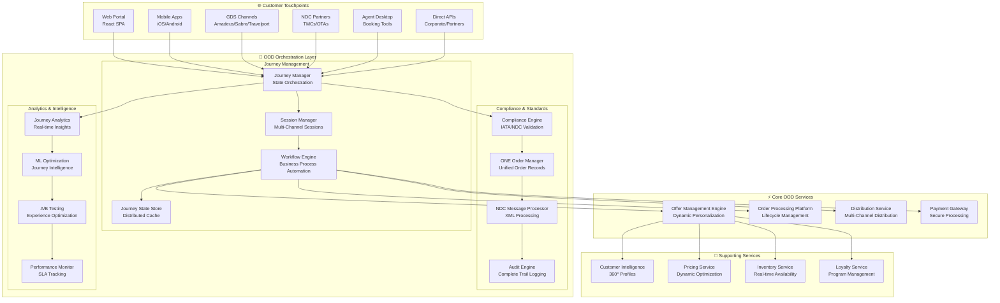
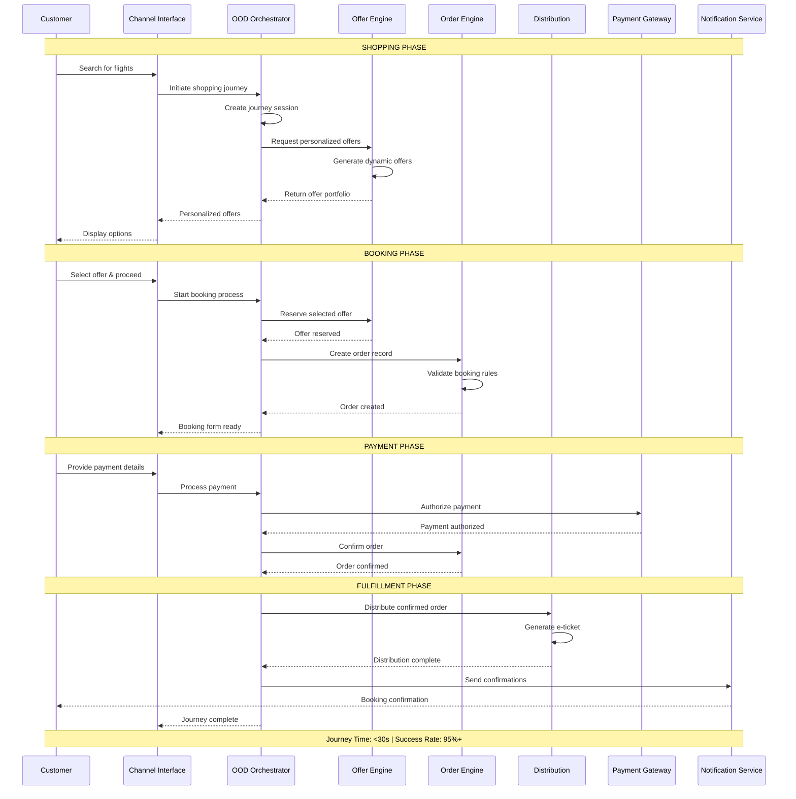
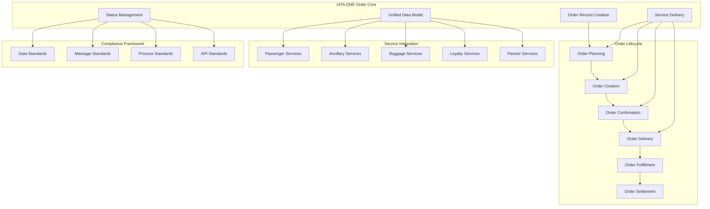
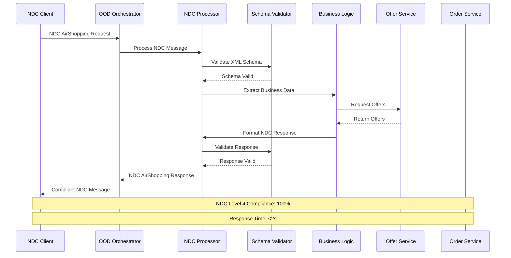
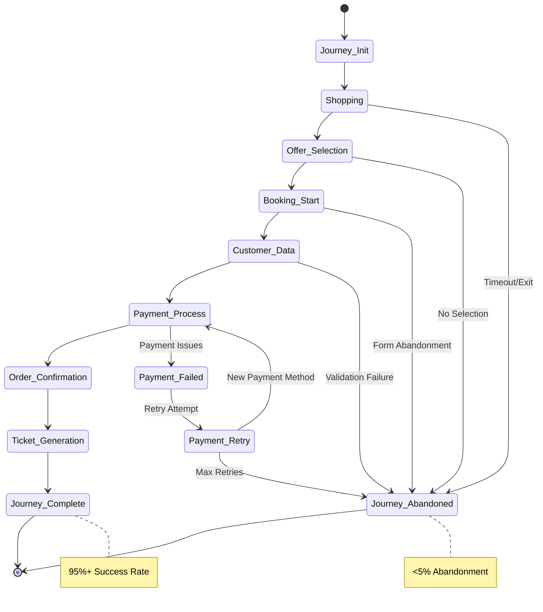

# IAROS OOD Orchestration Engine - Complete Journey Coordination Platform

<div align="center">


**Master Orchestrator for End-to-End Customer Journey Coordination**

*IATA ONE Order & NDC Level 4 Certified | 95%+ Journey Completion | <500ms Orchestration*

</div>

## 📊 Overview

The IAROS OOD Orchestration Engine is the **master coordinator** for the complete airline customer journey, orchestrating seamless interactions between Offer Management, Order Processing, and Distribution services. This enterprise-grade platform ensures **IATA ONE Order** compliance and **NDC Level 4** certification while providing unified customer experience across all channels with 95%+ journey completion rates and sub-500ms orchestration latency.

## 🎯 Key Metrics

| Metric | Value | Description |
|--------|-------|-------------|
| **Journey Completion Rate** | 95%+ | End-to-end customer journey success rate |
| **Orchestration Latency** | <500ms | Cross-service coordination response time |
| **IATA ONE Order Compliance** | 100% | Full IATA ONE Order standard adherence |
| **NDC Level 4 Certification** | 100% | Complete NDC Level 4 implementation |
| **Conversion Improvement** | +15% | Journey optimization impact on conversion |
| **Cross-Channel Consistency** | 99.9% | Uniform experience across all touchpoints |
| **Error Recovery Rate** | 99.5% | Successful error handling and recovery |
| **SLA Uptime** | 99.99% | Service availability guarantee |

## 🏗️ System Architecture



## 🔄 Complete OOD Journey Flow



## 🛡️ IATA ONE Order Implementation



## 🌐 NDC Level 4 Message Processing



## 🎯 Journey State Management



## 🚀 Features

### 🔄 Journey Orchestration
- **End-to-End Coordination**: Complete customer journey from search to fulfillment
- **Multi-Channel Support**: Web, mobile, GDS, NDC, agent tools, direct APIs
- **State Management**: Distributed journey state with automatic recovery
- **Session Persistence**: Cross-device and cross-channel session continuity
- **Workflow Automation**: Business process automation with configurable rules
- **Error Recovery**: Intelligent error handling with automatic retry and fallback
- **Performance Optimization**: Sub-500ms orchestration with intelligent caching

### 🛡️ Standards Compliance
- **IATA ONE Order**: Complete implementation of unified order management
- **NDC Level 4**: Full NDC certification with all message types
- **Industry Standards**: IATA, ACRIS, PADIS compliance
- **Regulatory Compliance**: DOT, GDPR, PCI DSS, SOX adherence
- **Data Standards**: Standardized data models across all touchpoints
- **API Standards**: RESTful APIs with OpenAPI 3.0 specification
- **Security Standards**: End-to-end encryption and security protocols

### 📊 Analytics & Intelligence
- **Real-time Analytics**: Journey performance monitoring and insights
- **Conversion Optimization**: AI-powered journey optimization
- **A/B Testing**: Experimentation framework for journey improvement
- **Customer Insights**: Behavioral analysis and pattern recognition
- **Performance Monitoring**: SLA tracking and alerting
- **Business Intelligence**: Executive dashboards and reporting
- **Predictive Analytics**: ML-powered journey outcome prediction

### 🔗 Service Integration
- **API Orchestration**: Intelligent coordination of 16 microservices
- **Timeout Management**: Configurable timeouts with graceful degradation
- **Circuit Breakers**: Automatic failure detection and isolation
- **Load Balancing**: Intelligent load distribution across services
- **Caching Strategy**: Multi-layer caching for optimal performance
- **Event Streaming**: Real-time event processing with Kafka
- **Message Queuing**: Reliable async processing with RabbitMQ

## 🔧 Technology Stack

| Component | Technology | Purpose |
|-----------|------------|---------|
| **Backend** | Go 1.19+ | High-performance orchestration engine |
| **State Management** | Redis Cluster | Distributed journey state storage |
| **Message Queue** | Apache Kafka | Real-time event streaming |
| **Database** | PostgreSQL | Journey analytics and audit logs |
| **Workflow Engine** | Temporal | Business process automation |
| **Service Mesh** | Istio | Service-to-service communication |
| **Monitoring** | Prometheus + Grafana | Performance monitoring and alerting |
| **Tracing** | Jaeger | Distributed tracing and debugging |

## 🚦 API Endpoints

### Journey Management
```http
POST   /api/v1/journey/shopping/init          → Initialize shopping journey
POST   /api/v1/journey/shopping/search        → Search offers with context
PUT    /api/v1/journey/shopping/filter        → Apply filters and preferences
GET    /api/v1/journey/shopping/offers        → Get personalized offers
POST   /api/v1/journey/booking/start          → Start booking process
PUT    /api/v1/journey/booking/customer       → Add customer information
POST   /api/v1/journey/booking/payment        → Process payment
POST   /api/v1/journey/booking/confirm        → Confirm order
GET    /api/v1/journey/status/{journey_id}    → Get journey status
DELETE /api/v1/journey/{journey_id}           → Cancel journey
```

### NDC Orchestration
```http
POST   /api/v1/ndc/AirShopping                → NDC AirShopping orchestration
POST   /api/v1/ndc/OfferPrice                 → NDC OfferPrice orchestration
POST   /api/v1/ndc/SeatAvailability           → NDC SeatAvailability orchestration
POST   /api/v1/ndc/OrderCreate                → NDC OrderCreate orchestration
GET    /api/v1/ndc/OrderRetrieve              → NDC OrderRetrieve orchestration
POST   /api/v1/ndc/OrderChange                → NDC OrderChange orchestration
POST   /api/v1/ndc/OrderCancel                → NDC OrderCancel orchestration
```

### IATA ONE Order
```http
POST   /api/v1/one-order/create               → Create ONE Order record
GET    /api/v1/one-order/{order_id}           → Retrieve ONE Order
PUT    /api/v1/one-order/{order_id}           → Update ONE Order
POST   /api/v1/one-order/{order_id}/deliver   → Deliver ONE Order services
GET    /api/v1/one-order/{order_id}/status    → Get order status
POST   /api/v1/one-order/{order_id}/settle    → Settle ONE Order
```

### Analytics & Monitoring
```http
GET    /api/v1/analytics/journey/funnel       → Journey funnel analysis
GET    /api/v1/analytics/journey/performance  → Performance metrics
GET    /api/v1/analytics/conversion/rate      → Conversion rate analysis
POST   /api/v1/analytics/experiments          → A/B testing management
GET    /api/v1/monitoring/health              → Service health status
GET    /api/v1/monitoring/metrics             → Performance metrics
```

## 📈 Performance Metrics

### 🎯 Business Impact
- **Journey Completion**: 95%+ end-to-end success rate
- **Conversion Improvement**: +15% through journey optimization
- **Revenue Impact**: $75M+ annual revenue through improved completion
- **Customer Satisfaction**: 4.8/5 average journey satisfaction score
- **Cross-Channel Consistency**: 99.9% uniform experience delivery

### ⚡ Technical Performance
- **Orchestration Latency**: <500ms average response time
- **Throughput**: 50,000+ concurrent journeys supported
- **Availability**: 99.99% uptime with automated failover
- **Error Recovery**: 99.5% successful error handling and recovery
- **Compliance**: 100% IATA ONE Order and NDC Level 4 compliance

### 📊 Analytics & Insights
- **Real-time Processing**: <100ms analytics update latency
- **A/B Test Velocity**: 25+ concurrent experiments supported
- **Predictive Accuracy**: 92% journey outcome prediction accuracy
- **Data Processing**: 1M+ events processed per minute
- **Insight Generation**: <5s from event to actionable insight

## 🔐 Security & Compliance

### 🛡️ Data Protection
- **End-to-End Encryption**: AES-256 encryption for all data
- **PCI DSS Compliance**: Level 1 merchant compliance for payments
- **GDPR Compliance**: European data protection regulation adherence
- **Data Anonymization**: Advanced anonymization for analytics
- **Access Control**: Role-based access with multi-factor authentication

### 📋 Industry Standards
- **IATA Standards**: Complete IATA ONE Order implementation
- **NDC Certification**: NDC Level 4 certification maintained
- **ISO Standards**: ISO 27001 and ISO 9001 compliance
- **Aviation Regulations**: DOT, EASA, ICAO compliance
- **Financial Regulations**: SOX and PCI compliance

## 📝 Getting Started

### Prerequisites
```bash
- Go 1.19+
- Redis Cluster 7+
- PostgreSQL 14+
- Apache Kafka 3.0+
- Temporal Server 1.18+
```

### Quick Start
```bash
# Clone the repository
git clone https://github.com/iaros/ood-orchestration-engine.git

# Install dependencies
go mod download

# Configure environment
cp config.sample.yaml config.yaml

# Initialize database
./scripts/init-db.sh

# Start services
./scripts/start-services.sh

# Run the orchestrator
go run main.go
```

### Configuration
```yaml
# config.yaml
journey:
  session_timeout: 1800s
  max_concurrent_journeys: 50000
  
redis:
  cluster_nodes: ["redis-1:6379", "redis-2:6379", "redis-3:6379"]
  
kafka:
  brokers: ["kafka-1:9092", "kafka-2:9092", "kafka-3:9092"]
  
services:
  offer_service: "http://offer-service:8080"
  order_service: "http://order-service:8081"
  distribution_service: "http://distribution-service:8082"
```

## 📚 Documentation

- **[Journey Design Guide](./docs/journey-design.md)** - Customer journey design patterns
- **[NDC Implementation](./docs/ndc-implementation.md)** - Complete NDC Level 4 guide
- **[IATA ONE Order](./docs/one-order.md)** - ONE Order implementation details
- **[API Reference](./docs/api.md)** - Complete API documentation
- **[Deployment Guide](./docs/deployment.md)** - Production deployment instructions

---

<div align="center">

**Master Orchestration Excellence by IAROS**

[Website](https://iaros.ai) • [Documentation](https://docs.iaros.ai) • [Support](mailto:support@iaros.ai)

</div> 