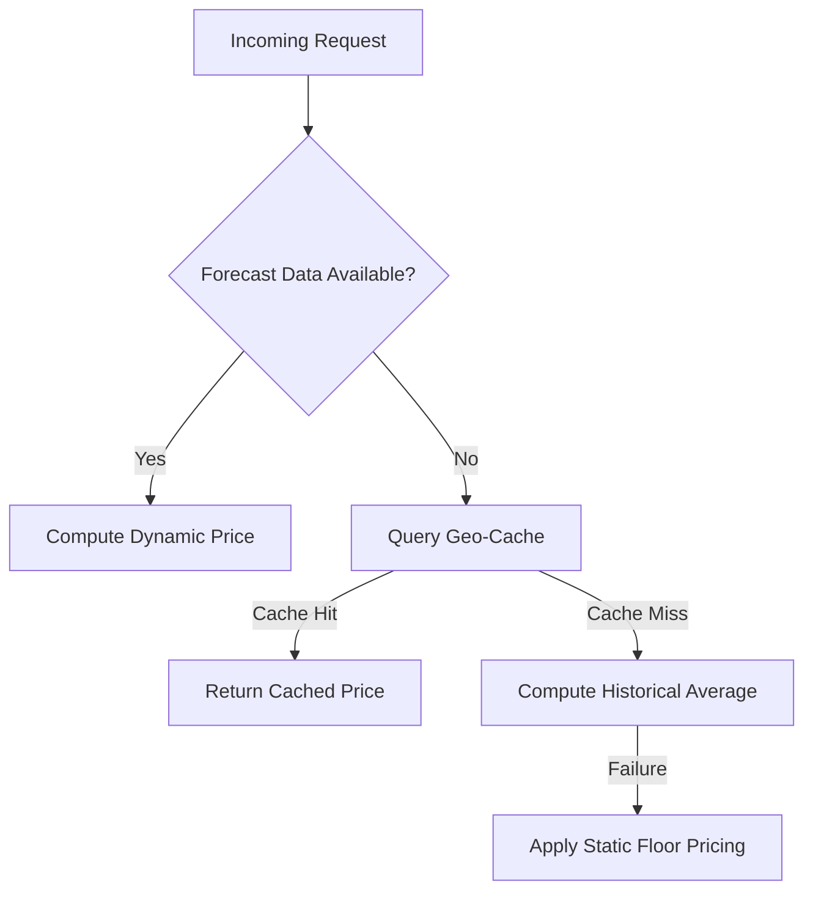

## Pricing Service for IAROS
This module implements a dynamic pricing engine for 142 scenarios. It integrates with the forecasting service to adjust fares in real time based on geo‑fencing, corporate contracts, and event‑driven adjustments. Robust fallback mechanisms (via the FallbackEngine) ensure uninterrupted service even if live data is delayed.

### Key Features
- **Dynamic Pricing Algorithms:** Implements multiple pricing scenarios.
- **Integration with Forecasting:** Adjusts fares based on predictive data.
- **Fallback Architecture:** 4‑layer cascading failover (live pricing, geo‑cache, historical moving average, static floor pricing).
- **Compliance:** ATPCO Rule 245, IATA NDC Level 4, GDPR Art.35 ensured.
- **Scenario Coverage:** 142 dynamic pricing scenarios plus 23 additional edge cases.

### Operational Excellence
- **SLA:** 99.999% uptime; response time <200ms..
- **Audit Trail:** Immutable logging of every pricing decision.
- **Fallback Logging**: Automatic logging of fallback events (e.g., geo_cache, historical, static_floor).

For detailed design, refer to [Pricing_Engine_Design.md](../../technical_blueprint/Pricing_Engine_Design.md).
