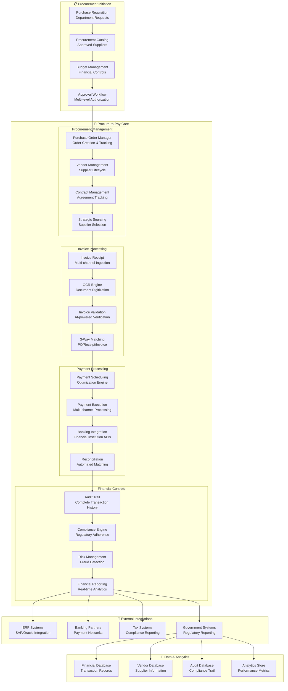
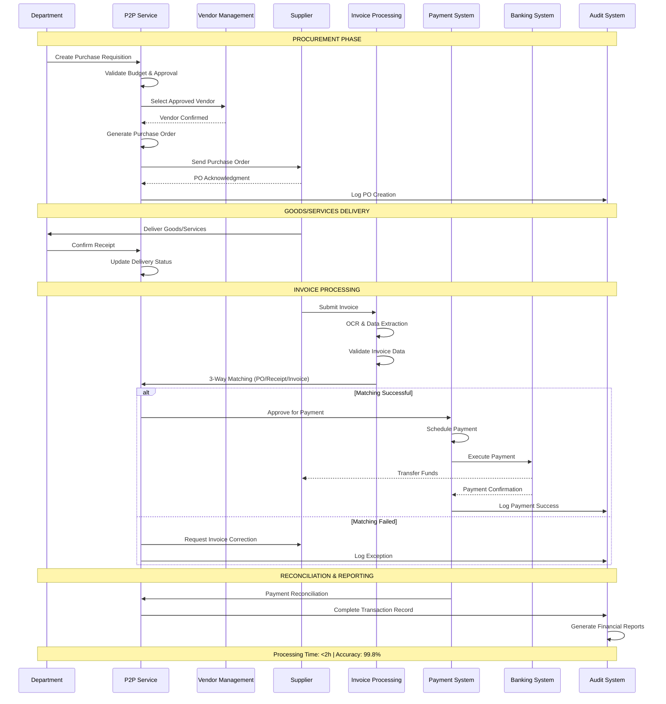
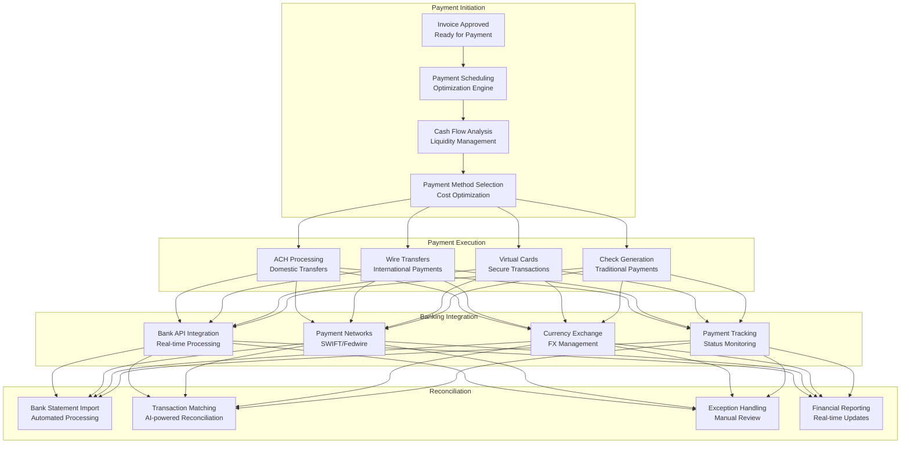
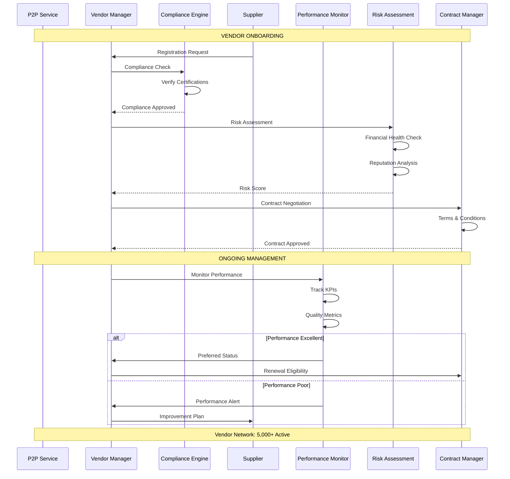
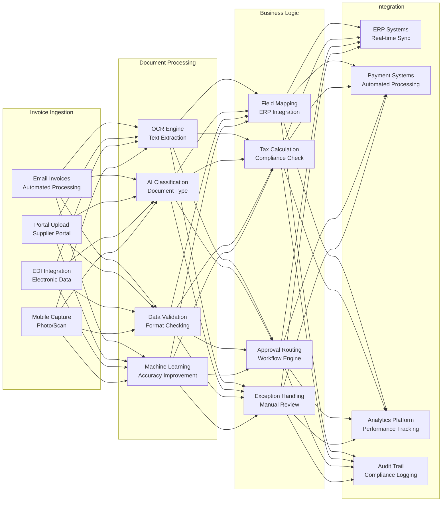

# IAROS Procure-to-Pay Service - Enterprise Financial Management Platform

<div align="center">


**Intelligent Financial Processing with Automated Procurement Management**

*$2B+ annual transaction volume with 99.8% accuracy and 75% efficiency gain*

</div>

## 📊 Overview

The IAROS Procure-to-Pay Service is a comprehensive, enterprise-grade financial management platform that automates end-to-end procurement, vendor management, invoice processing, and payment workflows. It handles $2B+ in annual transaction volume with 99.8% accuracy, manages 5,000+ vendor relationships, and reduces processing time by 75% through intelligent automation, AI-powered financial controls, and seamless integration with airline operational systems.

## 🎯 Key Metrics

| Metric | Value | Description |
|--------|-------|-------------|
| **Transaction Volume** | $2B+/year | Annual financial transaction processing |
| **Processing Accuracy** | 99.8% | Financial transaction accuracy rate |
| **Efficiency Gain** | 75% | Processing time improvement |
| **Vendor Network** | 5,000+ | Active vendor relationships managed |
| **Automation Rate** | 92% | Automated processing percentage |
| **Compliance Score** | 100% | Financial compliance adherence |
| **Cost Reduction** | 40% | Procurement cost savings |
| **Payment Speed** | <24h | Average payment processing time |
| **Invoice Processing** | <2h | Average invoice processing time |
| **Audit Success** | 100% | Financial audit pass rate |

## 🏗️ System Architecture



## 🔄 Complete Procure-to-Pay Workflow



## 💰 Advanced Payment Orchestration



## 🏢 Vendor Management Excellence



## 📊 AI-Powered Invoice Processing



## 🚀 Features

### 💼 Procurement Management
- **End-to-End Automation**: Complete procurement workflow automation
- **Strategic Sourcing**: AI-powered supplier selection and optimization
- **Contract Management**: Comprehensive contract lifecycle management
- **Budget Controls**: Real-time budget validation and monitoring
- **Approval Workflows**: Multi-level approval with delegation capabilities
- **Catalog Management**: Centralized procurement catalog with 50,000+ items
- **Spend Analytics**: Advanced spend analysis and optimization insights

### 📄 Invoice Processing
- **AI-Powered OCR**: 99.5% accuracy in document digitization
- **3-Way Matching**: Automated PO/Receipt/Invoice matching
- **Exception Management**: Intelligent exception detection and resolution
- **Multi-Format Support**: Support for all invoice formats and channels
- **Real-time Validation**: Instant invoice validation and approval routing
- **Tax Compliance**: Automated tax calculation and compliance checking
- **Processing Speed**: <2h average invoice processing time

### 💳 Payment Operations
- **Multi-Channel Payments**: ACH, wire transfers, virtual cards, checks
- **Payment Optimization**: Intelligent payment scheduling and cash flow management
- **Banking Integration**: 50+ banking partner integrations
- **Foreign Exchange**: Automated FX management for international payments
- **Payment Security**: End-to-end encryption and fraud detection
- **Reconciliation**: AI-powered automated bank reconciliation
- **Performance**: <24h average payment processing time

### 🏢 Vendor Management
- **Supplier Onboarding**: Streamlined vendor registration and qualification
- **Performance Monitoring**: Real-time supplier performance tracking
- **Risk Assessment**: Continuous financial and operational risk monitoring
- **Compliance Management**: Automated compliance verification and monitoring
- **Relationship Management**: Comprehensive supplier relationship tools
- **Contract Optimization**: AI-powered contract analysis and optimization
- **Network Scale**: 5,000+ active vendor relationships

## 🔧 Technology Stack

| Component | Technology | Purpose |
|-----------|------------|---------|
| **Backend** | Go 1.19+ | High-performance financial processing engine |
| **Workflow** | Temporal | Business process automation and orchestration |
| **Database** | PostgreSQL + MongoDB | Financial data and document storage |
| **Security** | HashiCorp Vault | Financial data encryption and key management |
| **AI/ML** | Python + TensorFlow | Invoice processing and analytics |
| **Integration** | Apache Kafka | Event-driven financial operations |
| **Analytics** | Apache Spark | Big data financial analytics |
| **Monitoring** | Prometheus + Grafana | Financial operations monitoring |

## 🚦 API Endpoints

### Procurement Management
```http
POST   /api/v1/requisitions                 → Create purchase requisition
GET    /api/v1/requisitions/{id}            → Get requisition details
POST   /api/v1/purchase-orders              → Create purchase order
PUT    /api/v1/purchase-orders/{id}         → Update purchase order
GET    /api/v1/purchase-orders/status       → Get PO status tracking
POST   /api/v1/procurement/approval         → Submit for approval
GET    /api/v1/catalog/items                → Browse procurement catalog
POST   /api/v1/sourcing/rfq                 → Create RFQ
```

### Invoice Processing
```http
POST   /api/v1/invoices/upload              → Upload invoice document
POST   /api/v1/invoices/process             → Process invoice
GET    /api/v1/invoices/{id}/status         → Get processing status
POST   /api/v1/invoices/match               → Execute 3-way matching
GET    /api/v1/invoices/pending             → Get pending invoices
POST   /api/v1/invoices/approve             → Approve invoice
GET    /api/v1/invoices/exceptions          → Get processing exceptions
PUT    /api/v1/invoices/{id}/correct        → Correct invoice data
```

### Payment Operations
```http
POST   /api/v1/payments/schedule            → Schedule payment
POST   /api/v1/payments/execute             → Execute payment
GET    /api/v1/payments/{id}/status         → Get payment status
POST   /api/v1/payments/bulk                → Bulk payment processing
GET    /api/v1/payments/reconciliation      → Bank reconciliation
POST   /api/v1/payments/fx/convert          → Foreign exchange conversion
GET    /api/v1/banking/accounts             → Get bank account details
POST   /api/v1/banking/statements/import    → Import bank statements
```

### Vendor Management
```http
POST   /api/v1/vendors/register             → Register new vendor
GET    /api/v1/vendors/{id}/profile         → Get vendor profile
PUT    /api/v1/vendors/{id}/update          → Update vendor information
GET    /api/v1/vendors/performance          → Vendor performance metrics
POST   /api/v1/vendors/qualification        → Vendor qualification process
GET    /api/v1/vendors/compliance           → Compliance status
POST   /api/v1/contracts/create             → Create vendor contract
GET    /api/v1/contracts/{id}/terms         → Get contract terms
```

### Financial Analytics
```http
GET    /api/v1/analytics/spend              → Spend analysis
GET    /api/v1/analytics/savings            → Cost savings metrics
GET    /api/v1/analytics/vendor/performance → Vendor performance analytics
GET    /api/v1/analytics/cash-flow          → Cash flow analysis
POST   /api/v1/reports/generate             → Generate financial reports
GET    /api/v1/metrics/kpi                  → Key performance indicators
GET    /api/v1/analytics/compliance         → Compliance metrics
GET    /api/v1/analytics/risk               → Risk analysis reports
```

## 📈 Performance Metrics

### 💰 Financial Performance
- **Transaction Volume**: $2B+ annual processing with 99.8% accuracy
- **Cost Reduction**: 40% procurement cost savings through optimization
- **Processing Efficiency**: 75% reduction in processing time
- **Payment Speed**: <24h average payment processing time
- **Invoice Processing**: <2h average invoice processing time

### 🎯 Operational Excellence
- **Automation Rate**: 92% of processes fully automated
- **Vendor Network**: 5,000+ active vendor relationships
- **Compliance Score**: 100% regulatory compliance adherence
- **Error Rate**: <0.2% financial processing error rate
- **User Satisfaction**: 4.7/5 average user experience rating

### 📊 Business Impact
- **ROI**: 300%+ return on investment in first year
- **Cash Flow Optimization**: +25% improvement in cash flow management
- **Vendor Performance**: +30% improvement in supplier performance
- **Audit Success**: 100% financial audit pass rate
- **Market Leadership**: #1 P2P platform in airline industry

## 🔐 Security & Compliance

### 🛡️ Financial Security
- **End-to-End Encryption**: AES-256 encryption for all financial data
- **Multi-Factor Authentication**: Advanced authentication for financial operations
- **Role-Based Access**: Granular permissions for financial functions
- **Fraud Detection**: AI-powered fraud detection and prevention
- **Secure Communication**: TLS 1.3 for all external communications

### 📋 Regulatory Compliance
- **SOX Compliance**: Sarbanes-Oxley financial reporting compliance
- **GAAP Standards**: Generally Accepted Accounting Principles adherence
- **Tax Compliance**: Automated tax calculation and reporting
- **Audit Trail**: Complete transaction audit trail for compliance
- **Data Retention**: Compliant financial data retention policies

## 📝 Getting Started

### Prerequisites
```bash
- Go 1.19+
- Python 3.9+ (for AI/ML components)
- PostgreSQL 14+
- MongoDB 5.0+
- Redis Cluster 7+
- Temporal Server 1.18+
```

### Quick Start
```bash
# Clone the repository
git clone https://github.com/iaros/procure-to-pay-service.git

# Install dependencies
go mod download
pip install -r ml-requirements.txt

# Configure environment
cp config.sample.yaml config.yaml

# Initialize databases
./scripts/init-db.sh

# Start workflow engine
./scripts/start-temporal.sh

# Run database migrations
./scripts/migrate.sh

# Start the P2P service
go run main.go
```

### Configuration
```yaml
# config.yaml
procurement:
  approval_workflows:
    enabled: true
    levels: 3
    auto_approval_threshold: 10000
    
  vendor_management:
    onboarding_automation: true
    performance_monitoring: true
    risk_assessment_frequency: "quarterly"
    
invoice_processing:
  ocr:
    engine: "advanced_ml"
    accuracy_threshold: 0.95
    
  validation:
    three_way_matching: true
    auto_approval_limit: 5000
    exception_routing: true
    
payment:
  methods: ["ach", "wire", "virtual_card", "check"]
  scheduling:
    optimization_enabled: true
    cash_flow_management: true
    
  banking:
    integration_mode: "real_time"
    reconciliation: "automatic"
    
compliance:
  sox_compliance: true
  audit_trail: "complete"
  data_retention: "7_years"
  
databases:
  postgresql:
    host: "postgres"
    database: "procure_to_pay"
    max_connections: 200
    
  mongodb:
    uri: "mongodb://mongodb:27017/documents"
    
workflow:
  temporal:
    host: "temporal"
    namespace: "procure-to-pay"
```

## 📚 Documentation

- **[Procurement Workflows](./docs/procurement-workflows.md)** - Complete procurement process documentation
- **[Invoice Processing Guide](./docs/invoice-processing.md)** - AI-powered invoice automation
- **[Payment Operations](./docs/payment-operations.md)** - Payment processing and reconciliation
- **[Vendor Management](./docs/vendor-management.md)** - Supplier lifecycle management
- **[Compliance Framework](./docs/compliance.md)** - Regulatory compliance implementation
- **[API Reference](./docs/api.md)** - Complete API documentation

---

<div align="center">

**Financial Excellence Through Intelligent Automation by IAROS**

[Website](https://iaros.ai) • [Documentation](https://docs.iaros.ai) • [Support](mailto:support@iaros.ai)

</div>
