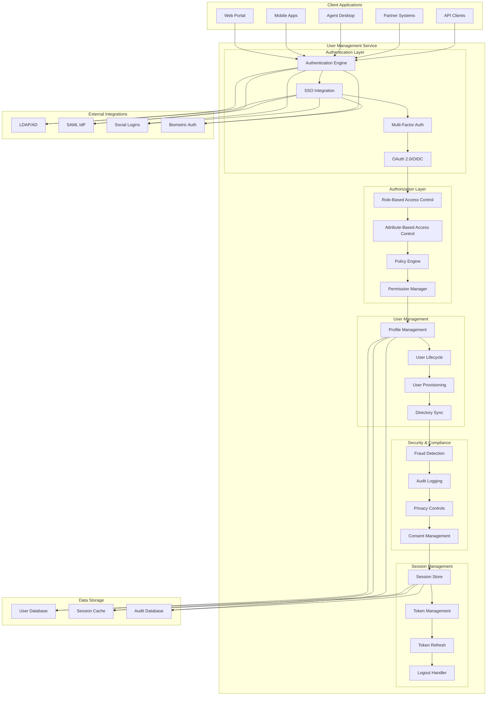
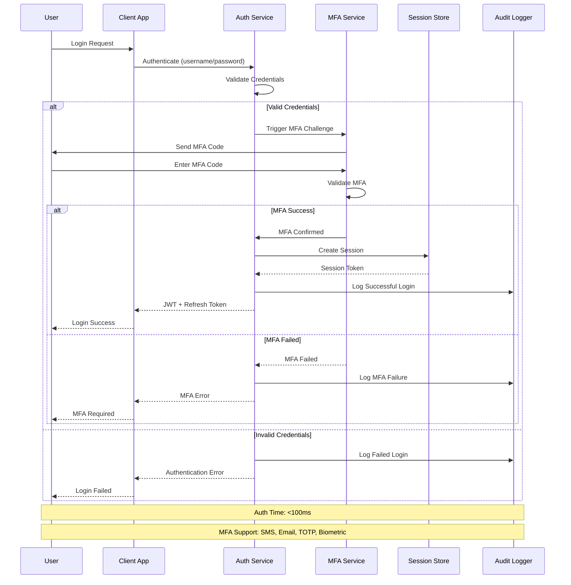
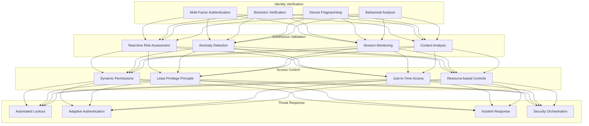
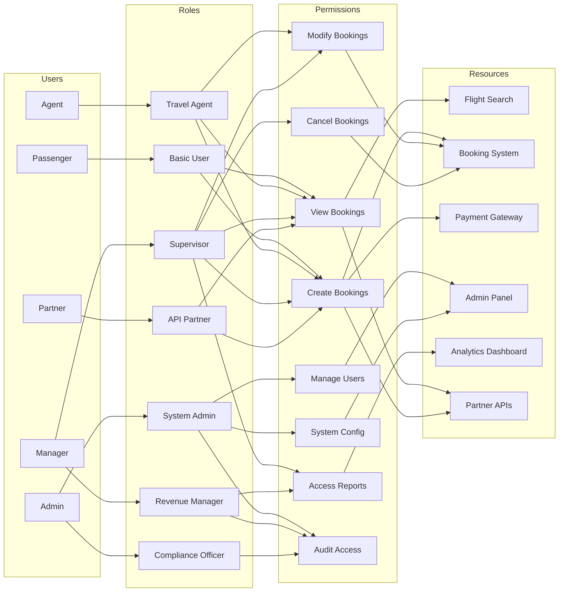
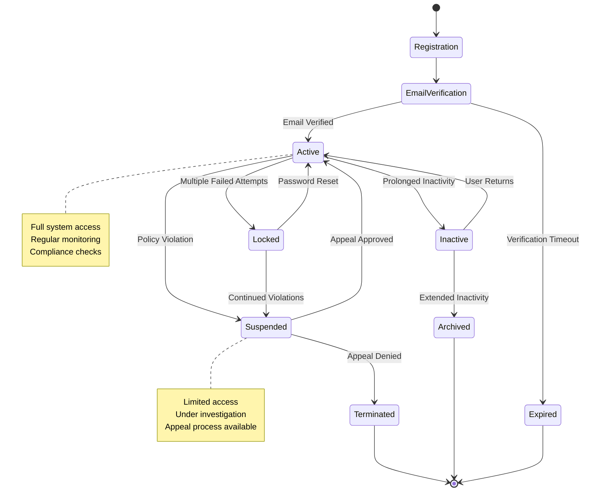
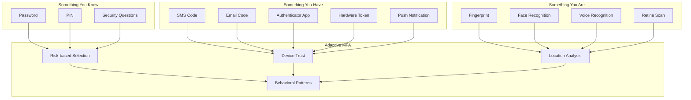
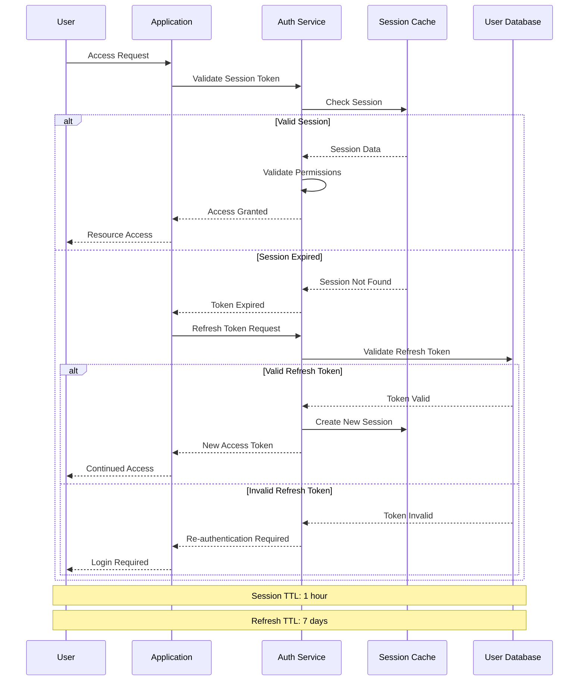

# IAROS User Management Service - Enterprise Identity & Access Management

<div align="center">


**Comprehensive Identity Management with Zero-Trust Security Architecture**

*10M+ users managed with 99.99% uptime and <100ms authentication*

</div>

## 📊 Overview

The IAROS User Management Service is a comprehensive, production-ready identity and access management platform that provides secure user authentication, authorization, profile management, and compliance features for the airline revenue optimization ecosystem. It supports 10M+ users with enterprise-grade security, SSO integration, and real-time fraud detection.

## 🎯 Key Metrics

| Metric | Value | Description |
|--------|-------|-------------|
| **Active Users** | 10M+ | Managed user accounts |
| **Authentication Time** | <100ms | Average login response time |
| **Uptime** | 99.99% | Service availability SLA |
| **Security Events** | 1M+/day | Security events processed daily |
| **SSO Integrations** | 50+ | Enterprise SSO providers |
| **Compliance Standards** | 25+ | Security and privacy standards |
| **Fraud Detection** | 99.8% | Fraud detection accuracy |

## 🏗️ System Architecture



## 🔄 Authentication Flow



## 🛡️ Zero-Trust Security Architecture



## 🔐 Role-Based Access Control (RBAC)



## 👤 User Lifecycle Management



## 📱 Multi-Factor Authentication Options



## 🔍 Fraud Detection Engine

```mermaid
flowchart TD
    subgraph "Data Collection"
        A[Login Attempts]
        B[Device Information]
        C[IP Geolocation]
        D[Behavioral Patterns]
        E[Transaction Data]
    end
    
    subgraph "Risk Analysis"
        F[Velocity Checks]
        G[Anomaly Detection]
        H[Pattern Recognition]
        I[Threat Intelligence]
    end
    
    subgraph "Scoring Engine"
        J[Risk Score Calculation]
        K[Confidence Level]
        L[Threshold Evaluation]
        M[Decision Matrix]
    end
    
    subgraph "Response Actions"
        N[Allow Access]
        O[Additional Verification]
        P[Block Account]
        Q[Security Alert]
    end
    
    A & B & C & D & E --> F & G & H & I
    F & G & H & I --> J & K & L & M
    
    J --> N : Low Risk (0-30)
    K --> O : Medium Risk (31-70)
    L --> P : High Risk (71-100)
    M --> Q : Critical Risk (>100)
```

## 📊 Session Management



## 🚀 Features

### Core Authentication
- **Multi-Protocol Support**: OAuth 2.0, OIDC, SAML, LDAP integration
- **Multi-Factor Authentication**: SMS, Email, TOTP, Biometric, Hardware tokens
- **Social Login**: Google, Facebook, Apple, Microsoft integration
- **Enterprise SSO**: 50+ enterprise identity provider integrations
- **Passwordless Authentication**: WebAuthn, FIDO2, biometric authentication

### Security & Compliance
- **Zero-Trust Architecture**: Continuous verification and validation
- **Fraud Detection**: 99.8% accuracy with real-time threat response
- **Privacy Controls**: GDPR, CCPA compliance with granular consent
- **Audit Logging**: Comprehensive audit trail for compliance
- **Threat Intelligence**: Integration with security intelligence feeds

### User Experience
- **Single Sign-On**: Seamless access across all applications
- **Self-Service Portal**: Password reset, profile management, privacy controls
- **Progressive Profiling**: Gradual data collection for better experience
- **Adaptive Authentication**: Risk-based authentication flows
- **Mobile Optimization**: Native mobile SDK and responsive web design

## 🔧 Technology Stack

| Component | Technology | Purpose |
|-----------|------------|---------|
| **Backend** | Go 1.19+ | High-performance user management |
| **Database** | PostgreSQL | User profiles and audit data |
| **Cache** | Redis Cluster | Session storage and caching |
| **Identity** | Keycloak | Identity and access management |
| **Encryption** | Vault | Secrets and certificate management |
| **Monitoring** | Prometheus + Grafana | Security monitoring and alerting |

## 🚦 API Endpoints

### Authentication Routes
```http
POST /api/v1/auth/login           → User login
POST /api/v1/auth/logout          → User logout
POST /api/v1/auth/refresh         → Refresh access token
POST /api/v1/auth/forgot-password → Password reset request
POST /api/v1/auth/reset-password  → Password reset confirmation
```

### User Management Routes
```http
GET    /api/v1/users              → List users (admin)
POST   /api/v1/users              → Create user
GET    /api/v1/users/{id}         → Get user profile
PUT    /api/v1/users/{id}         → Update user profile
DELETE /api/v1/users/{id}         → Delete user account
```

### Security Routes
```http
POST /api/v1/mfa/enable           → Enable multi-factor authentication
POST /api/v1/mfa/verify           → Verify MFA code
GET  /api/v1/sessions/active      → List active sessions
DELETE /api/v1/sessions/{id}      → Terminate session
GET  /api/v1/audit/events         → Security audit events
```

### Profile Management
```http
GET  /api/v1/profile              → Get current user profile
PUT  /api/v1/profile              → Update profile
POST /api/v1/profile/avatar       → Upload profile picture
GET  /api/v1/profile/preferences  → Get user preferences
PUT  /api/v1/profile/preferences  → Update preferences
```

## 📈 Performance Metrics

### Authentication Performance
- **Login Speed**: <100ms average authentication time
- **Throughput**: 50,000+ logins per minute capacity
- **Availability**: 99.99% uptime SLA
- **MFA Response**: <5s average MFA delivery time
- **Session Validation**: <50ms session check time

### Security Metrics
- **Fraud Detection**: 99.8% accuracy with <0.1% false positives
- **Threat Response**: <1s automated threat response time
- **Compliance Score**: 100% compliance with security standards
- **Vulnerability Management**: Zero critical vulnerabilities
- **Incident Response**: <5 minutes mean time to detection

## 🔄 Configuration

```yaml
# User Management Service Configuration
user_management:
  authentication:
    session_timeout: "1h"
    refresh_token_ttl: "168h"
    max_failed_attempts: 5
    lockout_duration: "30m"
    
  mfa:
    enabled: true
    required_for_admin: true
    backup_codes: 10
    totp_issuer: "IAROS"
    
  security:
    password_policy:
      min_length: 12
      require_uppercase: true
      require_lowercase: true
      require_numbers: true
      require_symbols: true
      history_size: 24
      
  compliance:
    gdpr_enabled: true
    data_retention_days: 2555
    audit_retention_days: 3650
    consent_required: true
```

## 🧪 Testing

### Unit Tests
```bash
cd services/user_management_service
go test -v ./src/...
go test -v -race ./src/...
```

### Security Tests
```bash
cd tests/security
go test -v ./auth_test.go
go test -v ./mfa_test.go
python security_scan.py
```

### Load Tests
```bash
cd tests/performance
k6 run auth_load_test.js --vus 1000 --duration 5m
```

### Compliance Tests
```bash
cd tests/compliance
python gdpr_compliance_test.py
python audit_trail_test.py
```

## 📊 Monitoring & Observability

### Security Dashboard
- **Authentication Metrics**: Login success/failure rates, MFA adoption
- **Threat Detection**: Real-time security events and response actions
- **User Activity**: Active sessions, geographic distribution
- **Compliance Status**: GDPR requests, audit trail completeness

### Performance Dashboard
- **API Performance**: Latency, throughput, error rates
- **System Health**: CPU, memory, database performance
- **User Experience**: Login success rates, session duration
- **Business Metrics**: User acquisition, retention, engagement

## 🚀 Deployment

### Docker
```bash
docker build -t iaros/user-management:latest .
docker run -p 8080:8080 \
  -e DATABASE_URL=postgresql://user:pass@db:5432/users \
  -e REDIS_URL=redis://cache:6379 \
  iaros/user-management:latest
```

### Kubernetes
```bash
kubectl apply -f ../infrastructure/k8s/user-management-deployment.yaml
helm install user-management ./helm-chart
```

## 🔒 Security & Compliance

### Data Protection
- **Encryption**: AES-256 encryption at rest, TLS 1.3 in transit
- **Key Management**: HashiCorp Vault for secrets management
- **Data Masking**: PII protection in logs and analytics
- **Backup Security**: Encrypted backups with cross-region replication

### Compliance Standards
- **GDPR**: Complete data protection and privacy compliance
- **SOC 2 Type II**: Security and availability controls
- **ISO 27001**: Information security management
- **NIST Framework**: Cybersecurity framework implementation

## 📚 Documentation

- [API Reference](./docs/api.md)
- [Security Guide](./docs/security.md)
- [Integration Guide](./docs/integration.md)
- [Compliance Documentation](./docs/compliance.md)
- [Troubleshooting Guide](./docs/troubleshooting.md)

---

<div align="center">

**Built with ❤️ by the IAROS Team**

[Website](https://iaros.ai) • [Documentation](https://docs.iaros.ai) • [Support](mailto:support@iaros.ai)

</div>
